# AgriASIC Digital MAS (Micro-Architecture Specification)

## 1. Document Control
- Project: Single-Die Impedance Sensing Node — low-power agricultural impedance sensing (senior design)
- Subsystem: Digital control, sequencing, and SPI control plane
- Process: TSMC 180nm MS/RF-G, Muse shared block
- RTL: `github.com/krishkc5/agrasic`, `agriasic_digital_v2`
- Team:
  - Krishna Chemudupati — analog front end
  - Vidhu Bulumulla — SAR ADC
  - Taarana Jammula — digital, integration *(owner of this document)*
- **Architecture baseline: `agriasic_rev43_phase_locked_design.pdf` (Rev 4.3), which supersedes Rev 4.2 of September 2026.** Where this MAS and that document disagree, the Rev 4.3 document wins and this one is wrong.
- Other basis documents:
  - agriasic_high_level_design_rev4_integrated_node.md
  - agriasic_digital_implementation_plan.md
  - agriasic_digital_timing_checklist.md
  - interface_contract.md
- MAS version: v0.11 (Rev 4.3 Phase 4 complete: free-running phase-locked excitation, measurement_fsm strobes on phase match, divider widened to 14 bits; sections 3.2, 4.3, 6.1-6.4, 6.11, 7.1-7.2, 9, 10, 11 updated)
- Date: 2026-09-05
- Trial GDS: 2026-11-18

### 1.1 How to read this document

An earlier draft of this MAS described the Rev 4.3 target architecture and the
Rev 4.2 mechanisms in the same voice, with no way to tell which sentences
described silicon-bound RTL and which described intent. That ambiguity is what
made a parallel branch look like an upgrade when it was in fact a regression.

Every architectural statement in this revision therefore carries a status tag:

| Tag | Meaning |
|---|---|
| **[IMPL]** | Implemented in RTL and covered by a passing regression |
| **[SPEC]** | Specified for Rev 4.3, **not yet in RTL** |
| **[GAP]** | Known conflict or unresolved question — read before designing against it |

**Current RTL state in one line:** the design is Rev 4.2 plus the three Rev 4.3
defect fixes (section 5), plus **Phases 1 through 4 of the Rev 4.3
restructure**: the analog boundary is frozen — break-before-make excitation
drive (`exc_drive_p_o`/`exc_drive_n_o`), the SAR bit-trial interface
(`adc_dac_o`/`adc_comp_i`, replacing `adc_code_i` entirely), and `miso_oe_o` —
clock/reset discipline is in place — a 2FF reset synchronizer per
chip-boundary top, and a verified core clock enable idle 93% of the time
during a real measurement (section 6.12) — SPI lives **entirely** in
the clk domain, with zero remaining exceptions to the single-clock-domain rule
(section 6.7) — and excitation is now **free-running and phase-locked**:
`excitation_ctrl` runs off the master clock alone, exports a 16-state phase
counter, and `measurement_fsm` strobes a sample whenever that counter matches
the phase it wants (section 6.1-6.4), with the divider widened end-to-end to
14 bits (section 10, GAP-1). I/Q accumulation and the indexed register
readout — sections 4.3, 6.2, 7.2 — remain **[SPEC]**, Phases 5 through 8 not
started.

### 1.2 Plain-language overview

*Everything else in this document is written for engineers. This section isn't
— it's for anyone who wants to understand what the chip does without reading
circuit diagrams.*

**The problem.** A farmer wants to know two things about their soil: how much
water is in it, and how much fertilizer or nutrient is in it. A single quick
measurement can't tell those apart — both make soil conduct electricity better,
so a naive reading just says "more conductive" without saying why.

**The trick.** Water and dissolved nutrients respond differently depending on
*how fast* you wiggle an electrical signal at them. Nutrients (dissolved salts)
respond strongly to a slow wiggle but barely react to a fast one. Water responds
about the same either way. So instead of one reading, the chip takes three —
one slow, one medium, one fast — by pushing a tiny, harmless electrical current
back and forth through two probes stuck in the soil. Comparing how the readings
change across the three speeds is what separates "this is wet" from "this is
salty."

Think of it like knocking on a wall to find a stud: one knock tells you
"something's there," but knocking at different spots and listening to how the
*sound* changes tells you whether it's wood or drywall. Same idea — different
"knocking speeds" instead of different spots.

**Why forwards and backwards.** At each speed, the chip doesn't just push
current one way — it pushes it, measures, then reverses and measures again. Any
error that's baked into the chip's own electronics (a tiny built-in bias, like a
scale that's slightly off before you even put anything on it) shows up
identically in both directions and cancels out when the two readings are
subtracted. Only the part that actually came from the soil survives. It's the
same reason a photograph taken with the light source moved to the opposite side
can reveal a scratch a single photo would hide — comparing the two shots cancels
out whatever doesn't depend on which side the light came from, and what's left
is the real feature.

**What this document's part of the chip actually does.** This MAS covers the
*digital* half of the chip — not the part that senses the soil, but the part
that runs the show around it. Three jobs, and only three:

1. **Keep perfect time.** Push the current one way, wait exactly long enough for
   it to settle, take a reading, flip it, wait, read again — over and over,
   thousands of times, with no variation in timing from one repetition to the
   next. A person or a general-purpose computer program couldn't do this
   reliably; the timing has to be built into the hardware itself, like a
   metronome that can't skip a beat.
2. **Add the readings up cleanly.** Repeating the same measurement many times
   and averaging cancels random noise, the same way asking ten people to guess
   the weight of an object and averaging their guesses beats any single guess.
   This part just needs to add correctly, without accidentally throwing away
   precision along the way.
3. **Hand the results to the outside world.** Once the readings are collected,
   the chip talks over a simple four-wire connection to whatever is asking for
   the data — a small computer, a gateway, eventually an app. It does not decide
   what the numbers *mean*. Turning "these raw numbers" into "your soil is 30%
   water with moderate nutrient levels" happens outside the chip, in software,
   afterward.

**Two workers inside the digital half.** There's a fast, single-minded worker
that does nothing but the precise back-and-forth timing in job 1 — it has to
react in fractions of a millionth of a second and never gets to think or make
decisions, only follow the same fixed rhythm exactly. And there's a slower,
smarter worker — a tiny built-in computer — that decides *when* to run a
measurement, at *which* of the three speeds, *how many times* to repeat it, and
then packages the results neatly before handing them off. If the project ever
needs to cut scope under schedule pressure, the smart worker can be removed
entirely and replaced with a fixed, simpler set of instructions — the
measurement itself doesn't change, only the ability to reprogram *when and how
often* it runs.

**What comes out the other end.** A small set of numbers per measurement cycle,
readable over that four-wire connection: the strength of the "water-like"
response and the "nutrient-like" response, for each of the three speeds, plus
the chip's own temperature (temperature affects the readings and has to be
accounted for). That's it — everything past that point, including the actual
moisture and nutrient percentages a farmer would look at, is somebody else's
software running elsewhere.

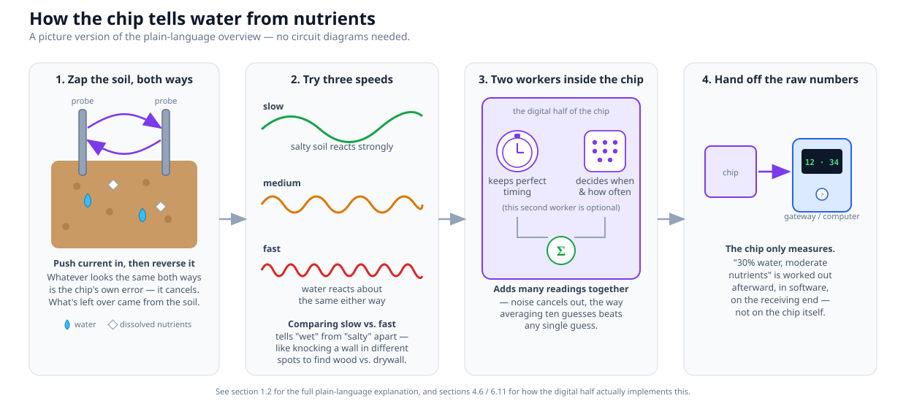

#### 1.2.1 The analog/digital boundary, in detail

The rest of this section zooms into one specific thing: the handful of wires
where the digital half described above actually touches the analog sensing
circuitry, and exactly what the three digital components on this side of that
boundary do with them. This is more detailed than the rest of section 1.2 —
it names real signals — but still written for someone who wants to
understand the mechanism, not read Verilog.

**As of Rev 4.3 Phase 1, exactly six wires cross the boundary** — five
carrying digital's instructions out, one carrying analog's answer back. (A
seventh output, `conv_start_o`, is kept on the pin list for compatibility and
host-side monitoring, but it fires in the exact same instant as one of the
six below and carries no information of its own — more on that at the end of
this subsection.)

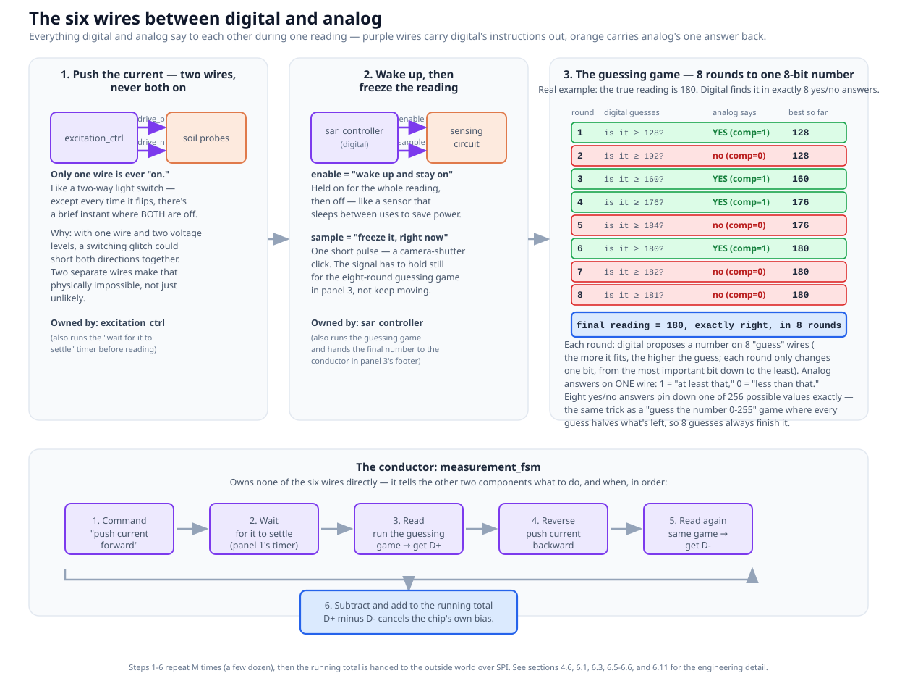

**1. The two drive wires (`exc_drive_p_o`, `exc_drive_n_o`) — pushing the
current.** Only one is ever switched on; the other is off. Think of a
two-way light switch, except this one has a deliberate, brief instant where
*both* sides are off every time it flips — never an instant where both are
on. That's not caution for its own sake: with a single wire carrying two
voltage levels instead, a switching glitch could momentarily connect both
directions together. Two separate wires, built so both-on is structurally
unreachable, make that a physical impossibility rather than something that's
merely unlikely. `excitation_ctrl` owns these two wires, and also runs the
timer that waits for the freshly-flipped current to settle before anything
downstream is allowed to read it.

**2. The enable wire (`adc_enable_o`) — waking the sensing circuit up.**
Held on for the entire duration of one reading, then switched off — the
low-power equivalent of a sensor that sleeps between uses instead of running
continuously. `sar_controller` owns this wire.

**3. The sample wire (`adc_sample_o`) — freezing the instant.** A single
short pulse telling analog "capture whatever you're seeing right now, and
hold that value steady." This matters because figuring out the exact value
takes the eight-round back-and-forth described next, and the input has to be
a still target throughout all eight rounds, not something that keeps
drifting while digital is still asking about it. `sar_controller` owns this
wire too.

**4. The guess wires (`adc_dac_o[7:0]`) and the answer wire (`adc_comp_i`) —
the guessing game.** This is the part worth the most explanation, because
it's the part that actually turns a held analog voltage into a digital
number. Digital doesn't ask analog "what's the value" and get a number back
directly — there's no wire that could carry that. Instead, it plays a
guessing game: digital proposes an 8-bit number on `adc_dac_o`, and analog
answers back on the single `adc_comp_i` wire with one bit — 1 meaning "the
true value is at least that," 0 meaning "it's less than that." Eight rounds
of this, each round refining one bit of the guess from most significant to
least, are enough to pin down the exact 8-bit answer out of all 256
possibilities — the same logic as a "guess my number between 0 and 255" game
where every answer eliminates half of what's left, so eight guesses always
finish it. The worked example in the illustration is a real one: a true
reading of 180 is found in exactly eight rounds — 128, then 192 (too high,
discarded), then 160, 176, 184 (too high, discarded), 180, 182 (too high,
discarded), 181 (too high, discarded) — landing on exactly 180.
`sar_controller` runs this whole exchange and owns both wires.

**Why the guess-and-check design instead of a wire that just reports the
number directly:** this is what a real analog-to-digital converter is
underneath, on any chip — there is no physical wire that carries an
arbitrary continuous voltage as a clean 8-bit digital number. Something has
to do the converting, one bit at a time, through exactly this kind of
back-and-forth. Which side runs that back-and-forth (a smart analog block
that does it internally, or the digital side driving it step by step through
`adc_dac_o`/`adc_comp_i`) is a design choice — Rev 4.3 moved the bit-trial
sequencing into digital, which is why `sar_controller` is more involved than
it used to be.

**The conductor: `measurement_fsm`.** It doesn't own any of the six wires
directly — instead it tells `excitation_ctrl` and `sar_controller` what to
do, and in what order, for one complete reading:

1. Command `excitation_ctrl` to push current one direction
2. Wait for the settle timer
3. Run the guessing game through `sar_controller` → get one 8-bit number, D+
4. Command the current reversed
5. Wait and read again → get a second 8-bit number, D−
6. Subtract (D+ minus D−) and add the result into a running total

Steps 1-6 repeat a few dozen times (the exact count is configurable), and the
running total — not each individual D+/D− pair — is what eventually reaches
the outside world over SPI. The subtraction in step 6 is where the "photograph
from two sides" trick from earlier in this section actually happens in wire
terms: whatever bias the chip's own electronics contribute shows up
identically in D+ and D−, so it cancels; only the part that came from the
soil survives into the running total.

**The loose end: `conv_start_o`.** It's a real pin, and it's not one of the
six — analog doesn't need it. `sar_controller` asserts it in the exact same
clock cycle as `adc_sample_o`, from the exact same trigger, so it carries no
information `adc_sample_o` doesn't already carry. It's kept on the interface
for two reasons: it matches the pin layout of the pre-Phase-1 design, and an
external host or logic analyzer watching the chip from outside can use it as
a simple "a conversion just started" marker without needing to know about the
sample/hold semantics specifically.

For the RTL-level version of everything above — exact port names, timing
diagrams, and what's implemented versus still specified — see sections 4.6,
6.1, 6.3, 6.5–6.6, and the cycle-by-cycle trace in 6.11.

The rest of this document is the engineering detail behind those three jobs:
exactly how the timing is built (section 6), what the wires and registers look
like (sections 4.6, 7), and what's already working versus still being designed
(the **[IMPL]** / **[SPEC]** tags throughout).

---

## 2. Purpose and Scope
This MAS defines the digital micro-architecture for measurement sequencing,
excitation/SAR handshake control, result accumulation, and SPI-visible
status/control behavior. It captures both implemented behavior and
requirement-driven acceptance criteria.

In scope:
- measurement_fsm, excitation_ctrl, sar_controller
- SPI slave and SPI protocol wrapper behavior
- register map, status/error semantics, and protocol framing
- reset, busy/done, and result observability contracts
- the RV32I policy shell and its port-compatible microsequencer fallback

Out of scope for this MAS revision:
- analog circuit implementation details
- multi-channel muxing
- on-die excitation amplitude DAC
- post-silicon calibration algorithm optimization
- magnitude, phase and calibration math (computed on the host, not on die)

---

## 3. Measurement Method and Operating Model

### 3.1 What the chip measures
Excitation is a bipolar square wave across two soil electrodes. Return current
passes through an on-die TIA into an 8-bit SAR ADC. Ionic conduction carries a
1/w factor and fades with frequency; water-driven permittivity does not. The chip
therefore sweeps three frequency points and, at each point, samples four phase
offsets to recover the in-phase and quadrature components:

```text
I = (D(0deg)  - D(180deg)) / 2
Q = (D(90deg) - D(270deg)) / 2
```

Opposite-phase subtraction cancels static TIA and ADC offset. The `/2` and all
magnitude/phase/calibration math are **host-side**; the die accumulates raw
signed differences only (section 6.4).

### 3.2 Equivalent-time sampling **[IMPL]** — Phase 4
Excitation is free-running and stationary: `excitation_ctrl` runs off the
master clock alone and never waits for the FSM. The ADC takes one phase point
per excitation cycle, and `measurement_fsm` samples that same point across many
cycles (once per pair), so a single SAR conversion (24+ clock cycles) does not
have to fit inside a half-cycle — the phase generator has already moved on to
later phases by the time a conversion finishes, and the next pair simply waits
for that phase to come back around. This is what makes a 10 MHz excitation
point tractable with an 8-bit SAR at 160 MHz. Verified by the phase-match
assertion in `tb/smoke/tb_agriasic_digital_top.sv` (section 6.11): every sample
lands on the exact phase index it was supposed to, not just "sometime during
the right half-cycle."

### 3.3 Two control loops
| Loop | Period | Nature | Owner |
|---|---|---|---|
| Inner | 100 ns at 10 MHz excitation | Hard real-time: phase strobe, 8 bit trials, signed accumulate | measurement_fsm (always hardware) |
| Outer | 10–100 ms | Soft: frequency selection, settle intervals, M, temperature, result packing, SPI | RV32I core |

**Software decides policy; hardware keeps time.** The FSM never gets a program
counter. Two reasons this partition is not negotiable:

- **Jitter is measurement noise.** The conversion fires a fixed number of cycles
  after the phase strobe, partway up the analog settling curve. If that instant
  moved with instruction timing, the ADC code would move with it — noise
  indistinguishable from signal.
- **The ± chop needs time symmetry.** `(D+ − D−)/2` cancels offset and drift only
  if both phases are timed identically. The FSM gives that structurally.

The core is clock-enabled off during accumulation bursts **[SPEC]**, which is
also the low-power state for a solar/battery node.

---

## 4. Top-Level Digital Architecture

### 4.1 Core partition **[IMPL]**
- Measurement sequencer: hardwired finite-state machine
- Excitation control: divider, phase control, settle counter
- SAR control: conversion request/latency/capture path
- SPI control plane: mode-0 slave + byte CDC + protocol decode
- Register interface: configuration writes and status/result mirrors

### 4.2 Control shell and descope path **[IMPL]**
Two shells exist behind an **identical 14-port interface**, verified port-for-port:

- `agriasic_rv32i_control_shell.sv` — RV32IM core + ROM + MMIO bridge
- `agriasic_rv32i_control_shell.sv.orig` — microsequencer stand-in

Either can be instantiated without touching `agriasic_digital_rv32i_top.sv`, so
the core can be dropped as a schedule descope without changing measurement
behavior. **This port identity is a standing constraint: any Rev 4.3 change to
one shell must be mirrored in the other.**

### 4.3 Phase-locked control partition **[IMPL]** (core mechanism, Phase 4) / **[SPEC]** (I/Q and register map, Phase 5-6)
Rev 4.3 inverts excitation control, and Phase 4 built the inversion. Under Rev
4.2, the FSM commanded each polarity flip, so excitation frequency was an
*emergent side effect* of the settle and conv register values — you could not
set a frequency, only discover one. As implemented now:

- The excitation generator (`excitation_ctrl`) is **free-running** from the
  master clock — it never waits on the FSM for anything.
- It exports a **16-state phase counter** (`phase_index_o[3:0]`) to the FSM,
  free-running 0-15 in lockstep with the divider.
- The FSM (`measurement_fsm`) strobes the sampler the cycle the counter
  matches the phase it wants (0 for D+, 8 for D-) — it no longer commands
  anything, it only watches.

```text
f_exc = f_clk / (16 * N),   f_clk = 160 MHz
```

verified exactly (not approximately) by `tb_excitation_drive.sv`: N=1 gives 16
clk cycles/period, N=5 gives 80, N=13 gives 208 — all exact, with no off-by-one
(see section 10, Phase 4 for the historical bug this fixes).

The measurement FSM is promoted from descope fallback to a permanent block
running in parallel with the core.

Functional split as implemented:

1. **RV32I core + ROM** — sweep program, frequency and phase index selection,
   settle intervals, M, temperature read, result packing, SPI service, sticky
   error and reset policy.
2. **Measurement FSM** — divider load (passthrough to `excitation_ctrl`), phase
   match detection, sample strobe generation, ADC start and busy handshake,
   raw accumulation, cycle counting, done flag. Sign selection by phase index
   and a **second** accumulator for Q are still `[SPEC]`, Phase 5.
3. **Peripheral register set** — config, status, indexed result readout,
   revision ID: still `[SPEC]`, Phase 6. The register map as implemented today
   (section 7.1) is the pre-Phase-6 8-register layout, with `REG_DIVIDER` now
   backed by a wider (14-bit) internal register than its 8-bit SPI window
   exposes — see section 7.1's note and GAP-1.

**Rev 4.3 target architecture** — the phase reference from the excitation
generator to the FSM is the key structural change, and it is now real RTL:

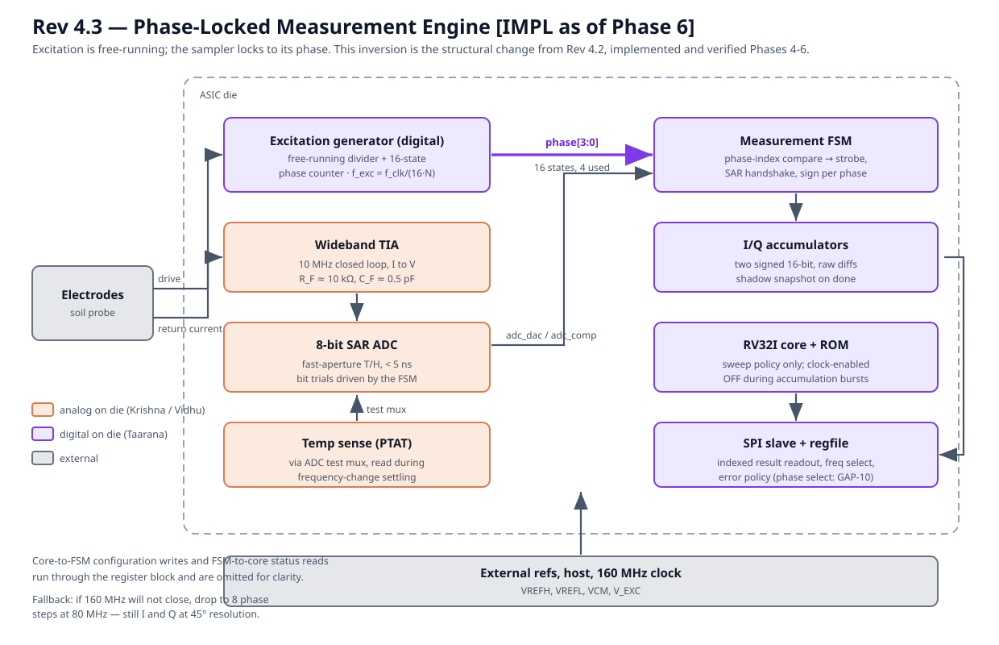

The control inversion itself, Rev 4.2 against Rev 4.3, with the phase-lock
strobe mechanism:

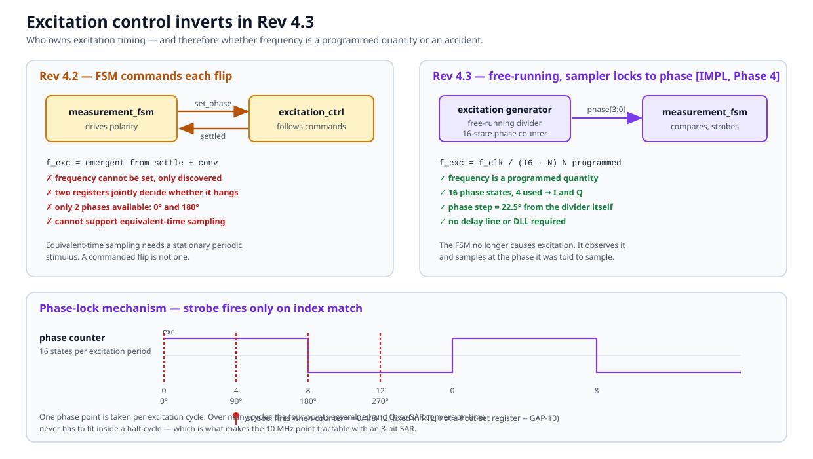

**Diagram staleness note:** both diagrams above were drawn against the Rev 4.3
*target* description before Phase 4 existed in RTL. The mechanism they show
(free-running divider, phase counter, strobe-on-match) is now accurate; what
they do not yet show is the actual signal names (`phase_index_o[3:0]`,
`period_tick_o`) or the fact that the FSM's states are now
`S_SETTLE -> S_WAIT_P -> S_SAMPLE_P -> S_WAIT_N -> S_SAMPLE_N -> S_ACCUM ->
S_LOOP` rather than the old `S_PHASE_P -> S_WAIT_P -> S_SAMPLE_P -> ...`.
Redrawing to match exact signal names is tracked as a documentation
follow-up, not yet done — same status as the module block diagrams in
section 6.

The **[IMPL]** control architecture as currently built is a separate diagram —
it predates Phase 4 and does not show the phase reference:

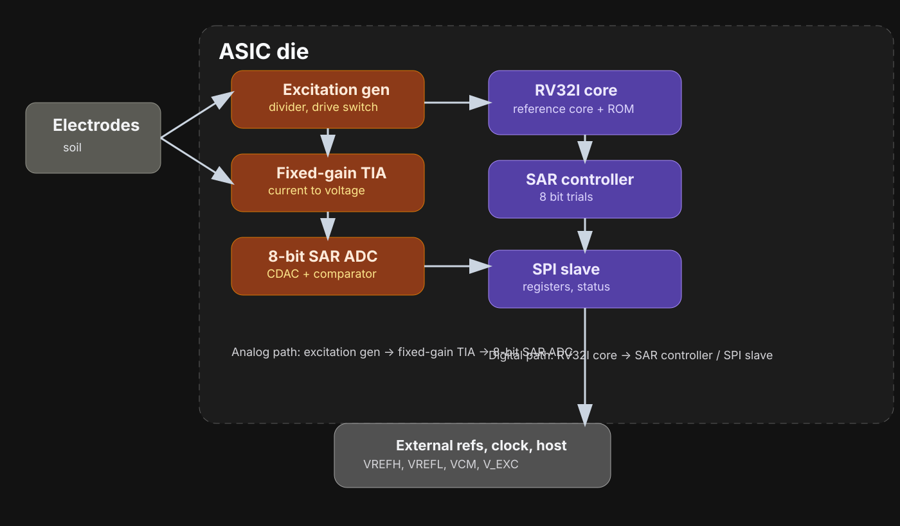

### 4.4 External interface assumptions
- External references remain off-die (VREFH, VREFL, VCM, V_EXC)
- External master clock source, 160 MHz
- Host is optional for measurement execution, used for setup/readback

### 4.5 Architecture diagrams
- High-level dataflow: [diagrams/agriasic_digital_dataflow_hl.svg](diagrams/agriasic_digital_dataflow_hl.svg)

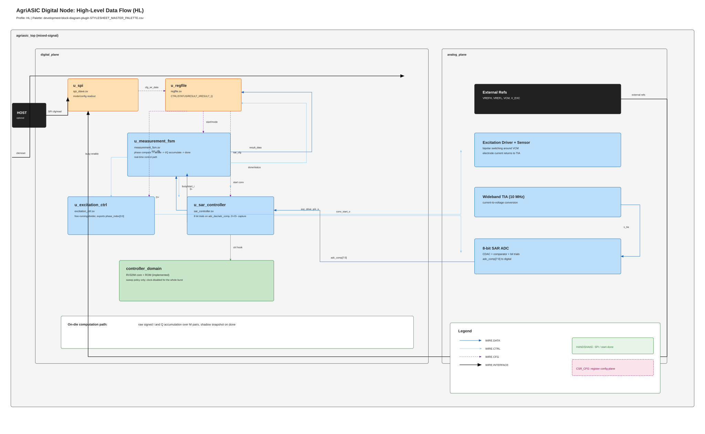

- Top integration block: [diagrams/modules/agriasic_digital_top_block_diagram.svg](diagrams/modules/agriasic_digital_top_block_diagram.svg)

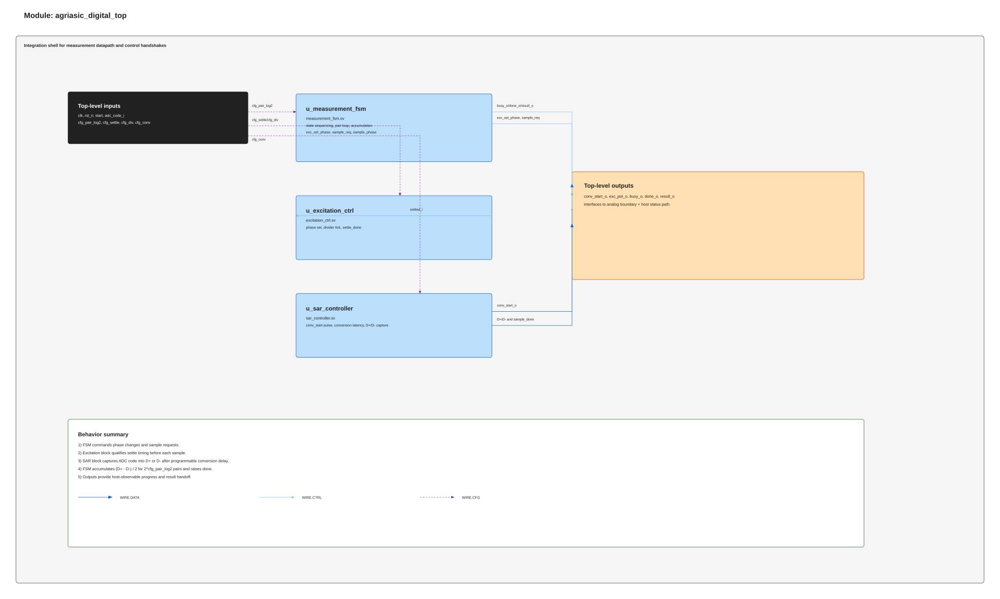

- Verilog orchestration flow: [diagrams/agriasic_digital_verilog_orchestration_flow.svg](diagrams/agriasic_digital_verilog_orchestration_flow.svg)

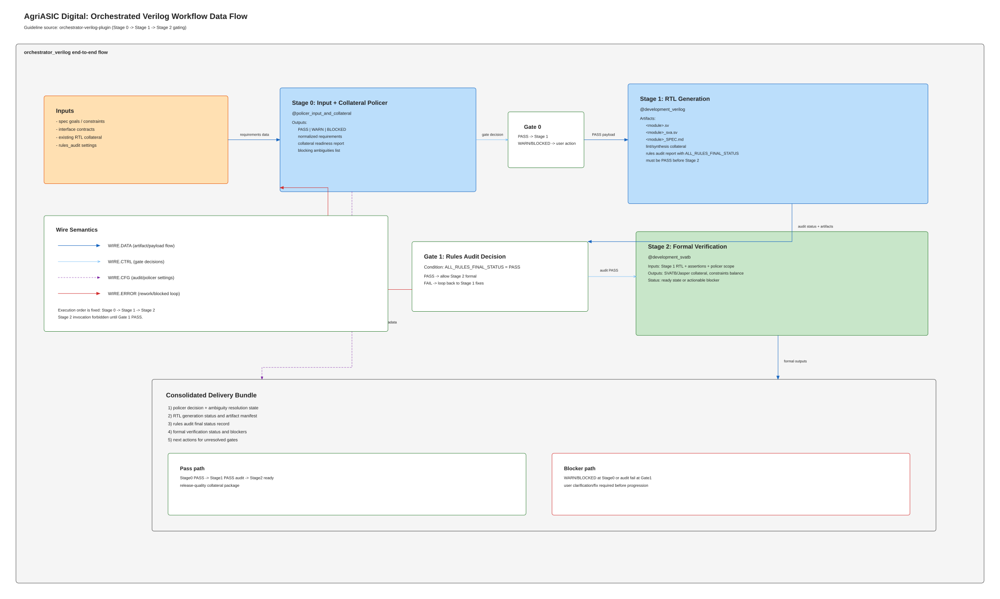

### 4.6 Data flow through the top-level wrappers **[IMPL]**

Four modules in the repository are named `*_top`. Only one of them contains the
measurement engine; the other three wrap it and differ only in **who supplies
the configuration**. This is the layering to keep straight when reading the RTL.

#### 4.6.1 `agriasic_digital_top` — the measurement engine itself

This is the innermost module — `excitation_ctrl` + `sar_controller` +
`measurement_fsm` wired together (section 6). Every other top instantiates this
one. Its full port list is the entire digital/analog contract as implemented
today:

```text
                  ┌─────────────────────────────────────────┐
      start   ──▶ │                                          │ ──▶ exc_drive_p_o
cfg_pair_log2 ──▶ │                                          │ ──▶ exc_drive_n_o
 cfg_settle   ──▶ │                                          │ ──▶ conv_start_o
 cfg_divider  ──▶ │           agriasic_digital_top           │ ──▶ adc_enable_o
 cfg_conv     ──▶ │                                          │ ──▶ adc_sample_o
                  │                                          │ ──▶ adc_dac_o[7:0]
  adc_comp_i  ──▶ │                                          │ ──▶ busy_o
                  │                                          │ ──▶ done_o
                  │                                          │ ──▶ result_o[15:0]
                  └─────────────────────────────────────────┘
```

**Six** signals cross the digital/analog boundary as of Rev 4.3 Phase 1 (up
from three pre-Phase-1): `exc_drive_p_o`, `exc_drive_n_o`, `adc_enable_o`,
`adc_sample_o` and `adc_dac_o[7:0]` go out to the analog front end;
`adc_comp_i` comes back in. `exc_pol_o` and `adc_code_i` no longer exist — see
section 6.3/6.6 for what replaced them, and section 1.2.1 for what each of
these six signals actually is and does, in plain language.

`conv_start_o` is **not** one of the six. It is still a real output pin, kept
for pin-compatibility with the pre-Phase-1 interface and for host-side
monitoring/debug, but it carries no information `adc_sample_o` doesn't
already carry — `sar_controller` asserts both in the exact same cycle, from
the exact same trigger (accepting a new sample request). Analog does not need
to consume it; a monitoring host or logic analyzer might.

Every other port on this module is either configuration coming in or
status/result going out, and all of it stays digital.

#### 4.6.2 The three wrappers

| Top | Adds | Who decides the recipe | Typical user |
|---|---|---|---|
| `agriasic_digital_top` | nothing — config ports are parallel inputs | whoever wires the pins | testbenches |
| `agriasic_digital_spi_top` | `sclk_i`, `cs_n_i`, `mosi_i`, `miso_o` | an external host, via SPI writes into `regfile` (section 6.10) | production host, bring-up |
| `agriasic_digital_programming_top` | `prog_cfg_we_i`, `prog_cfg_addr_i[1:0]`, `prog_cfg_data_i[7:0]`, `prog_start_i` | a firmware controller writing a compact register-poke interface | intermediate integration step |
| `agriasic_digital_rv32i_top` | the RV32IM core + ROM + `agriasic_rv32i_control_shell` (section 4.2) | on-chip firmware (`fw/fw.c`) | the chip as taped out |

In every case, the four config values — `cfg_pair_log2`, `cfg_settle_cycles`,
`cfg_exc_divider`, `cfg_conv_cycles` — and the `start` pulse are what actually
reach `agriasic_digital_top`. The wrappers only change **how those four values
get written**. `agriasic_digital_rv32i_top` additionally re-exposes them as
outputs (`cfg_*_o`), purely for debug and bring-up visibility — the core does not
read them back to make decisions.

Because `agriasic_digital_rv32i_top` and the microsequencer-backed shell
(section 4.2) are port-identical, swapping which controller drives these same
four wires is a file substitution, not a top-level rewire.

---

## 5. Defect Register

Three defects were reproduced in simulation and fixed before any restructuring.
All three were present in every branch of the design.

| # | Defect | Root cause | Fix | Status |
|---|---|---|---|---|
| D-1 | Settle interval never applied. `settle=0` and `settle=2` produced byte-identical 49-cycle runs | FSM held `exc_set_phase_o` for the whole settle state; `excitation_ctrl` reloaded on the level. `settled_o` is registered, so the FSM read the stale 1 from the previous phase and left before the countdown started | Phase command is rising-edge triggered in `excitation_ctrl`; FSM issues it from a dedicated one-cycle state | **Fixed [IMPL]** |
| D-2 | Deadlock whenever the settle countdown outlived the settle state. `settle>=5, conv=1` hung forever. Every settle value needed at 1 kHz sat in the hang region | The held command also pinned `settled_o` low, so the countdown branch never ran | Same change — the level no longer reloads the counter | **Fixed [IMPL]** |
| D-3 | `pair_delta` arithmetic-right-shifted each pair before accumulating, destroying averaging gain and adding sign-dependent bias. At M=8, a true difference of +1 accumulated to 0 (ideal +4) and −1 accumulated to −8 (ideal −4), because `>>>` rounds toward negative infinity | Per-pair scaling in hardware | Accumulate the raw signed difference; scale on the host. M clamped to 64 | **Fixed [IMPL]** |

### 5.1 Post-fix measured behavior **[IMPL]**
Settle now scales exactly linearly — 57 cycles at `settle=0`, +8 cycles per settle
count (8 settle intervals per 4-pair run):

| settle | conv | Before | After |
|---|---|---|---|
| 0 | 1 | 49 cycles | 57 |
| 2 | 1 | 49 cycles (no effect) | 73 |
| 5 | 1 | **hang** | 97 |
| 20 | 1 | **hang** | 217 |

Locked in by `tb/tb_settle_timing.sv`, which asserts monotonicity rather than
hardcoded cycle counts so it survives retiming.

### 5.2 Host contract change from D-3 **[IMPL]**
`REG_RESULT` is now `sum(D+ − D−)` over M pairs, **not** `sum((D+ − D−)/2)`.
Hosts must divide by M themselves. Every previously observed value doubles.
Worst case is `64 × 255 = 16320`, inside signed 16-bit.

### 5.3 Regression coverage caveat **[IMPL]**
After the D-1/D-2 fix, the smoke comparison against `sar_controller.sv.orig` no
longer distinguishes the pre-fix controller: both legs report 480 at the smoke
test's `settle=2, conv=1`. The pre-fix controller is still broken — at `settle=0`
it returns 60 instead of 480 — but that configuration happens to close the window
in which its missing `!sample_done_o` guard launches a spurious second
conversion. **Treat `tb_settle_timing.sv`, not the smoke comparison, as the test
covering that bug.**

---

## 6. Micro-Architecture by Module

### 6.1 measurement_fsm **[IMPL]** — reworked in Rev 4.3 Phase 4
Responsibilities:
- Accept start command in idle
- Wait out the settle interval, then watch the free-running phase counter for
  a match — **it no longer commands a polarity flip; it only watches**
- Sample D+ at phase index 0, D− at phase index 8
- Wait on `sar_done_i` to know a bit-trial conversion has finished
- Accumulate the raw signed per-pair difference
- Repeat until `pair_target` reached, then assert done

States (Phase 4 — the old command states `S_PHASE_P`/`S_PHASE_N` are gone;
there is nothing left to command):

```text
S_IDLE
S_SETTLE                     -- counts period_tick_i pulses, not raw cycles
S_WAIT_P -> S_SAMPLE_P        -- watches phase_index_i, samples at phase 0
S_WAIT_N -> S_SAMPLE_N        -- watches phase_index_i, samples at phase 8
S_ACCUM -> S_LOOP -> S_DONE
```

`S_WAIT_P`/`S_WAIT_N` are combinational watch states: the moment
`phase_index_i` equals the target (0 or 8 respectively), `sample_req_o` and
`sample_phase_o` fire **that same cycle** — including the case where the
target already matches on the very cycle the watch state is entered, which is
correct for equivalent-time sampling (section 3.2): there is no reason to wait
for a *fresh* match if the phase generator happens to already be sitting on
the right value. `S_SAMPLE_P`/`S_SAMPLE_N` then hold while the SAR conversion
that request triggered runs to completion (`sar_done_i`).

`settle_cycles_i` keeps its port name from the pre-Phase-4 design but changes
unit: it now counts **excitation periods** (`period_tick_i` pulses from
`excitation_ctrl`), not raw settle cycles — the same reinterpret-rather-than-
rename precedent as `conv_cycles_i` in section 6.6. `tb_settle_timing.sv`
confirms the new unit is monotonic and hang-free (section 10, Phase 4).

Configuration dependencies:
- `pair_log2` selects M = 2^pair_log2, **clamped to 64**

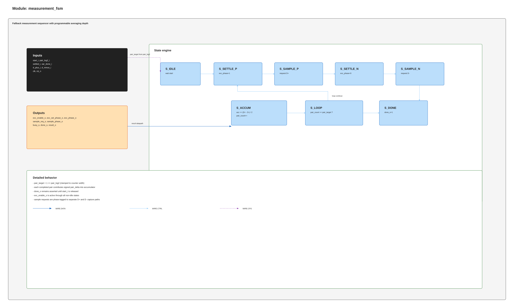
*(stale as of Phase 4: still shows the old command-state flow
`S_PHASE_P -> S_WAIT_P -> S_SAMPLE_P`. Redrawing this diagram is tracked as a
documentation follow-up, not yet done — same status as the other module block
diagrams in this section.)*

### 6.2 measurement_fsm, Rev 4.3 remaining target **[SPEC]** — Phase 5
- Selects accumulator and sign by phase index (0°/180° → I, 90°/270° → Q) —
  today there is exactly one phase pair (0/8) and one accumulator; the
  90°/270° pair and the second (Q) accumulator do not exist yet
- Drives two accumulators, not one
- Snapshots both into shadow registers on `done`

The phase-index-match strobing mechanism this section used to specify is done
— see section 6.1. What remains for Phase 5 is purely the I/Q split: a second
phase-index pair to watch for for the 90°/270° samples, and a second
accumulator to route them into.

### 6.3 excitation_ctrl **[IMPL]** — rewritten in Rev 4.3 Phase 4
Responsibilities:
- Run a **free-running 14-bit divider** and **4-bit phase counter**, both
  driven only by `enable_i` and `divider_i` — there is no command input from
  the FSM at all any more, not even implicitly
- Export the phase counter as `phase_index_o[3:0]`, free-running 0-15 forever
  while enabled, and a `period_tick_o` pulse once per full 16-phase period
- Drive the excitation electrodes through **two break-before-make outputs**,
  `drive_p_o` / `drive_n_o` (unchanged from Phase 1) as a pure combinational
  function of the current phase value

Behavior:
- `enable_i=0` drives a deterministic idle state (both drive lines low, phase
  counter held at 0)
- Phase encoding: **0-6 drive positive**, **7 is dead time**, **8-14 drive
  negative**, **15 is dead time** — 7 phase states per polarity half, exactly
  equal, and exactly one dead state between each transition
- `{drive_p_o, drive_n_o} = 2'b11` remains **structurally unreachable**:
  `drive_p_o` and `drive_n_o` are two mutually exclusive combinational ranges
  of the same phase counter, so no phase value can satisfy both — this is a
  property of the circuit, not a simulation result. Re-verified for the
  free-running design by `tb_excitation_drive.sv`'s `assert property` (below)
- `divider_i` (14 bits) is compared against an *effective* divider that floors
  at 1, so `divider_i=0` cannot stall the counter
- The tick comparison is `div_cnt_q == divider_i - 1`, **not** `>=` as in the
  pre-Phase-4 design — see the off-by-one note below

**Off-by-one bug found and fixed, not carried forward.** The pre-Phase-4
`excitation_ctrl` used a `>=`-style tick comparison that actually produced a
tick every `divider_i + 1` cycles, not `divider_i` cycles — harmless when
`divider_i` only qualitatively gated a "has enough time passed" settle check,
but unacceptable once `divider_i` must be a precise, host-computable N in
`f_exc = f_clk / (16·N)` (section 4.3). The new design was verified to
produce **exactly** N cycles per phase state: `tb_excitation_drive.sv` checks
N=1 (16 cycles/period), N=5 (80 cycles/period), and N=13 (208 cycles/period),
all exact with zero drift.

Verified by `tb_excitation_drive.sv` (regression stage 5, rewritten for the
free-running interface): exact N-cycles-per-phase and 16·N-cycles-per-period
timing at three divider values, the phase-to-drive map (0-6 P, 7 dead, 8-14 N,
15 dead), an `assert property` that `drive_p_o && drive_n_o` is never true on
any cycle, and idle behavior when `enable_i=0`.

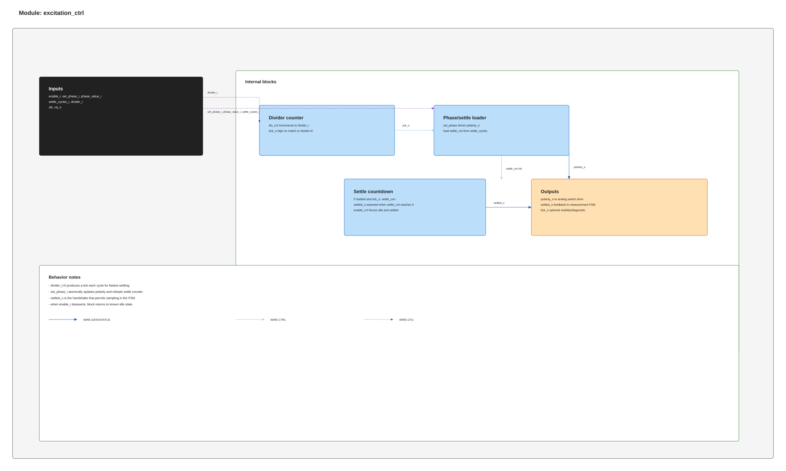
*(stale as of Phase 4, more so than after Phase 1: this diagram still shows
the single `polarity_o` output and a command input (`set_phase_i`) that no
longer exists at all — the module now has no command input whatsoever.
Redrawing this diagram is tracked as a documentation follow-up, not yet done.)*

### 6.4 excitation_ctrl, Rev 4.3 target **[IMPL]** — Phase 4 complete
- Free-running divider, no per-flip command from the FSM — **done**, see 6.3
- 4-bit phase counter exported as `phase_index_o[3:0]` — **done**
- Positive and negative half-cycles equal within one clock cycle for charge
  balance — **achieved exactly**: 7 phase states per half (0-6 and 8-14), each
  state lasting the same N cycles, so the two halves are equal to within a
  single clock cycle by construction, not by tuning

Nothing in this section is still `[SPEC]`; the free-running phase generator
Phase 4 set out to build is implemented and verified per section 6.3. The
half-cycle symmetry claim specifically was not measurable before Phase 4 (the
FSM-commanded flip had no fixed period to measure it against) and now is.

### 6.5 sar_controller **[IMPL]**
Responsibilities:
- Accept sample request when not busy (`S_IDLE`)
- Generate single-cycle `conv_start_o` pulse and a one-cycle `adc_sample_o`
  track-and-hold strobe when a request is accepted
- Assert `adc_enable_o` for the full conversion (accept through done)
- Run the **8-bit successive-approximation search itself** (Phase 1, Rev 4.3):
  drive `adc_dac_o[7:0]` with the current trial code, wait
  `conv_cycles_i` cycles for comparator regeneration, sample `adc_comp_i`, and
  decide the bit — MSB first, 8 trials per sample
- Capture the converged code into D+ or D− storage by phase
- Pulse `sample_done_o` when the last bit is decided

States: `S_IDLE → S_TRIAL_SET → S_TRIAL_WAIT → S_TRIAL_EVAL` (loops 8 times,
once per bit, then back to `S_IDLE`).

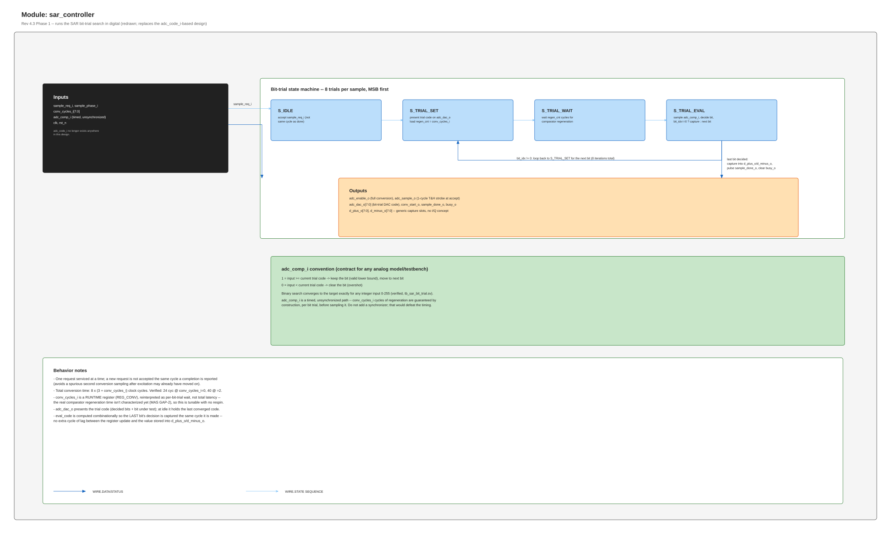
*(stale as of Phase 1: still shows the `adc_code_i` port. Redrawing this
diagram is tracked as a documentation follow-up, not yet done.)*

### 6.6 sar_controller — Rev 4.3 SAR bit-trial interface **[IMPL]**
The SAR bit trials now run **in digital**. The controller talks to the ADC
analog core, not to a self-contained converter returning a finished code.
`adc_code_i` is gone from every module in the hierarchy.

| Port | Direction | Purpose |
|---|---|---|
| `adc_enable_o` | out | Analog core enable, asserted for the full conversion |
| `adc_sample_o` | out | Track/hold strobe, one cycle at conversion start |
| `adc_dac_o[7:0]` | out | Bit-trial DAC code, MSB-first successive approximation |
| `adc_comp_i` | in | Comparator decision |

**`adc_comp_i` convention** (drive any analog model/testbench to this
contract): `1` = input ≥ current trial code (keep the bit, it's a valid lower
bound); `0` = input < current trial code (clear the bit, it overshot). Binary
search under this convention converges to the target exactly for any integer
input — verified for every code 0–255 including both endpoints, by
`tb_sar_bit_trial.sv` (regression stage 4).

`adc_comp_i` is **not synchronized** — it is a timed path, per the original
spec. The controller guarantees regeneration time by waiting `conv_cycles_i`
cycles between presenting a trial and sampling the decision.

**Design decision on `conv_cycles_i`:** the comparator regeneration time is not
yet characterized (GAP-2, unresolved — no number from analog as of this
writing). Rather than hardcode a guessed value as an RTL parameter,
`conv_cycles_i` — already a runtime register (`REG_CONV`) — was **reinterpreted**
as the regeneration wait *per bit trial* rather than *total latency before
reading one finished code*. This means the real regeneration time can be tuned
during bring-up by writing a register, with no respin required, once
characterized. Total conversion time is `8 × (3 + conv_cycles_i)` clock cycles;
verified empirically (24 cycles at `conv_cycles_i=0`, 40 at `conv_cycles_i=2`).

### 6.7 spi_slave **[IMPL]** — reworked in Rev 4.3 Phase 3
Responsibilities:
- SPI mode-0 shift and transaction bit counting, **entirely in the clk
  domain** — `sclk_i`, `cs_n_i` and `mosi_i` are 2FF-oversampled, and every
  bit/byte event is a detected edge on the synchronized signal, not a real
  clock edge
- One `rx_valid_o` pulse per completed byte, the **same clk cycle** the 8th
  bit is captured — there is no CDC left to cross for it

**What changed from the pre-Phase-3 design:** RX used to run on
`posedge sclk_i` and TX on `negedge sclk_i` — a real second clock domain
inside this module — with `rx_valid_o` crossing back into `clk` through a
toggle synchronizer. Both are gone. `grep -rn "always_ff @(" rtl/` finds zero
matches outside `posedge clk` anywhere in the synthesizable tree (the `.orig`
snapshot excepted) — this module was the last exception, and it no longer is
one. Removing the toggle synchronizer wasn't just a cleanup: it deleted the
entire class of "byte arrives a few cycles later than you'd think" bugs that
motivated the original TX workaround below.

TX timing is still the subtle part, now inside the clk domain: the first bit
of each byte is driven combinationally from `tx_data_i`, which has had the
whole inter-byte gap to settle; only the remaining seven bits come from the
shift register, loaded on the first *detected* falling edge of the byte. An
earlier version reloaded the shift register on the same edge that started the
old CDC crossing, so every read returned the prior transaction's byte — the
fix (drive bit 7 combinationally) carries forward unchanged in spirit, just
without a domain crossing to dodge anymore.

**Host requirement, tightened by Phase 3, not just carried forward:**
max SCLK = `f_clk/16`. This used to be soft (the old design had no
oversampling ratio to violate); now it's load-bearing — go faster and the 2FF
synchronizers cannot resolve edges reliably. `tb_spi_domain_crossing.sv`
verifies correct operation at exactly `f_clk/16` (not comfortably above it)
and demonstrates real data corruption at a rate below the sampling clock's
Nyquist rate, so this is a measured property, not an assumed one.

**cs_n and framing:** a synchronized `cs_n_i` rising edge resets only this
module's own bit counter and TX state — never anything outside it, which is
structurally guaranteed since this module has no access to measurement state
in the first place. `tb_spi_domain_crossing.sv` checks the practical
consequence: deselecting mid-byte and reselecting starts a clean new byte,
with no module reset needed.

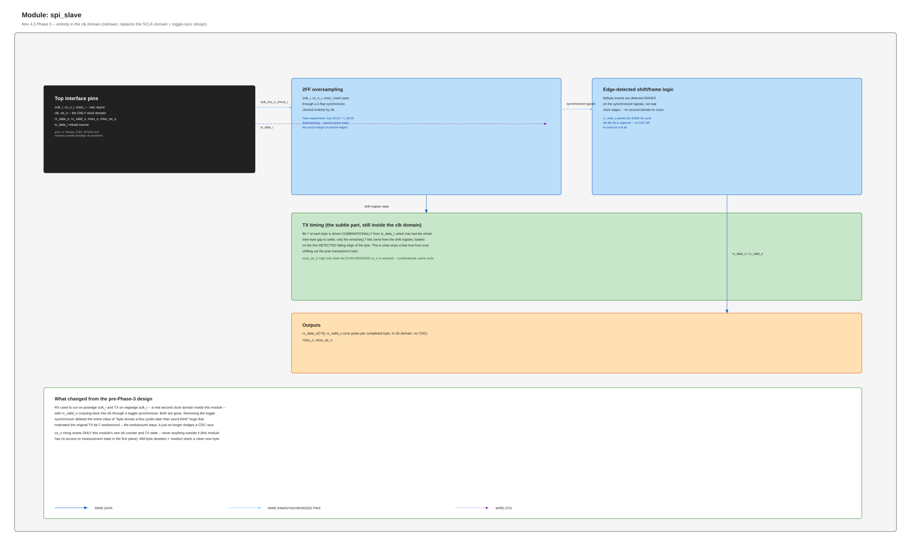
*(stale: still shows the old SCLK-domain RX/TX split and the toggle
synchronizer. Redrawing this diagram is tracked as a documentation
follow-up, matching the note already on the excitation_ctrl/sar_controller
diagrams.)*

### 6.9 agriasic_digital_spi_top **[IMPL]**
- Decode Byte0 command and track pending transaction context
- Enforce protocol legality checks before state mutation
- Generate response bytes for ACK/NACK/error conditions
- Keep parser alignment by consuming Byte1 for invalid Byte0
- Bridge config writes into core controls and mirror status/result

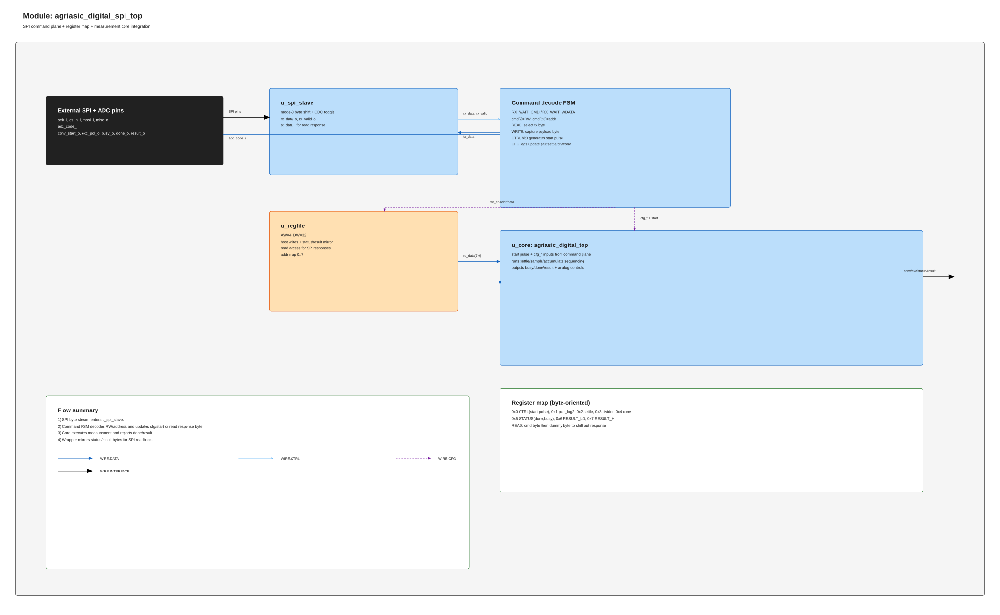

### 6.10 regfile **[IMPL]**
- Parameterized storage for software-visible config/status points
- Supports writes from the host path and the status/result mirror path

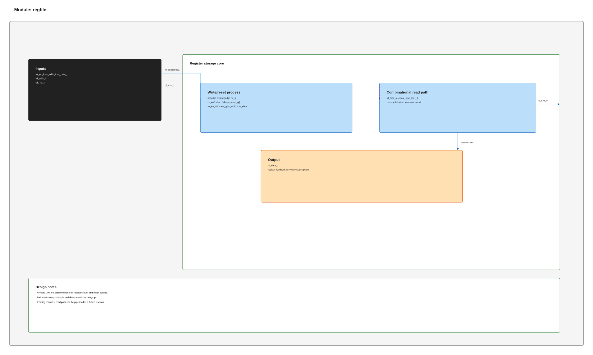

### 6.11 Worked example: tracing one measurement cycle **[IMPL]** — rewritten for Rev 4.3 Phase 4

This replaces the pre-Phase-4 trace, which walked through the now-deleted
`S_PHASE_P`/`S_WAIT_P`/`exc_set_phase_o` command-and-wait mechanism. The trace
below is a real Verilator run of `agriasic_digital_top` at the free-running
Phase 4 interface, same configuration and ADC model as
`tb/smoke/tb_agriasic_digital_top.sv`: `pair_log2=2` (M=4), `settle=2`
(excitation *periods*, section 6.1), `divider=1` (N=1, fastest excitation — 16
clk cycles/period, phase increments every clock), `conv=1`, and the
track-and-hold ADC model (section 10, Phase 4) returning `D+=180` when sampled
during the positive half and `D-=60` during the negative half.

Because `state_q` and `phase_index_o` are both registered, this trace logs a
row every time `state_q` **changes** — the interesting events — rather than
every single clock cycle as the pre-Phase-4 trace did; with a free-running
16-cycle phase counter there are far more clock edges than state changes to
show. `phase_idx` in the table is the phase counter's value at the moment the
**new** state is registered, one cycle after the actual phase match happened
(see the reading note below the table — this is the single trickiest thing
about reading a Phase 4 waveform).

#### First pair, state-change trace (N=1, so phase increments every clock)

| cyc | state entered | phase_idx | drive_p | drive_n | acc |
|---|---|---|---|---|---|
| 0 | S_IDLE | 0 | 0 | 0 | 0 |
| 3 | S_SETTLE | 0 | 1 | 0 | 0 |
| 37 | S_WAIT_P | 2 | 1 | 0 | 0 |
| 52 | S_SAMPLE_P | 1 | 1 | 0 | 0 |
| 85 | S_WAIT_N | 2 | 1 | 0 | 0 |
| 92 | S_SAMPLE_N | 9 | 0 | 1 | 0 |
| 125 | S_ACCUM | 10 | 0 | 1 | 0 |
| 126 | S_LOOP | 11 | 0 | 1 | **120** |

Reading it as a story:

1. **cyc 0-2 — reset, then start.** `S_IDLE` holds through reset; the start
   pulse is accepted and `S_SETTLE` is entered at cyc 3. `excitation_ctrl` is
   already free-running at this point — note `drive_p=1` at cyc 3, because the
   phase counter never stopped ticking, start command or not.
2. **cyc 3-36 — settle.** `S_SETTLE` waits for `period_tick_i` (one pulse per
   full 16-cycle excitation period) to reach `settle_cycles_i=2`. At N=1 that
   is 2 x 16 = 32 clock cycles; the trace shows 34 (37-3), the extra 2 cycles
   being state-entry/exit overhead, not a settle-count error — `tb_settle_timing`
   (section 10, Phase 4) separately confirms the settle-to-elapsed-time
   relationship is exact and monotonic.
3. **cyc 37-51 — wait for phase 0.** `S_WAIT_P` is entered with
   `phase_idx=2` — the excitation generator has moved on since settle finished
   and is not guaranteed to be sitting at phase 0 the instant settle completes.
   The FSM does nothing but watch `phase_index_i` combinationally until it
   equals 0. That match happens at cyc 51 (not shown as its own row: the
   match and the `S_SAMPLE_P` transition are both driven off the same edge,
   registering together at cyc 52).
4. **cyc 52 — S_SAMPLE_P entered, phase_idx reads 1, not 0.** This is the
   subtlety flagged above: `sample_req_o`/`sample_phase_o` fired
   *combinationally* on the cycle `phase_index_i==0` (cyc 51), but `state_q`
   only updates on the *next* clock edge (cyc 52) — and because N=1, the phase
   counter has *also* advanced by then, from 0 to 1. The sample itself is
   correctly captured at phase 0; only the printed `phase_idx` in this
   snapshot-on-transition trace is one step stale. This is exactly why
   `tb/smoke/tb_agriasic_digital_top.sv`'s phase-match assertion (section
   3.2) checks the phase value from the *previous* cycle, not the one visible
   when `S_SAMPLE_P` is first observed.
5. **cyc 52-84 — the D+ conversion runs.** `S_SAMPLE_P` holds for 33 cycles
   while `sar_controller` runs its 8-bit-trial search: `8 x (3 + conv_cycles_i)
   = 8 x 4 = 32` cycles (section 6.6), plus one cycle of state-entry overhead.
   The excitation phase counter keeps free-running underneath this the entire
   time — by the time the conversion finishes, phase has wrapped around
   several full periods, which is the whole point of equivalent-time sampling
   (section 3.2): the analog target was captured once, at the right instant,
   and held (track-and-hold) for the rest of the conversion.
6. **cyc 85-91 — wait for phase 8.** Same watch pattern as step 3, this time
   for the negative-phase target. `S_WAIT_N` enters at `phase_idx=2`; match
   occurs at phase 8 (cyc 91); `S_SAMPLE_N` registers at cyc 92 showing
   `phase_idx=9` for the same one-cycle-stale reason as step 4.
7. **cyc 92-124 — the D- conversion runs.** Another 33-cycle SAR search,
   this time with `drive_n=1` — the negative half of the chop.
8. **cyc 125 — subtract.** `S_ACCUM` computes `pair_delta = D+ - D- = 180 -
   60 = 120` and adds it with no scaling (D-3 fix, section 5).
9. **cyc 126 — loop check.** `acc=120` is now visible, `pair_count=1`. Since
   `pair_count (1) < pair_target (4)`, the FSM loops back to `S_WAIT_P`
   (cyc 127) instead of the old `S_PHASE_P` — there is nothing left to
   command, only a fresh phase match to wait for.

#### The remaining three pairs

Unlike the pre-Phase-4 trace (where every pair was a byte-for-byte repeat
because nothing but the FSM's own states advanced time), the *absolute* cycle
each subsequent pair starts at is not a fixed offset from the first — it
depends on where the free-running phase counter happens to be sitting when
each `S_WAIT_P`/`S_WAIT_N` state is entered. What **is** exactly repeatable is
each pair's *duration* once steady state is reached, because after the first
pair the FSM always re-enters `S_WAIT_P` at the same phase offset relative to
where the previous conversion ended:

| Pair | S_WAIT_P entered at cyc | S_LOOP entered at cyc | Pair duration | acc after S_LOOP |
|---|---|---|---|---|
| 1 | 37 (settle-gated, not comparable) | 126 | — | 120 |
| 2 | 127 | 206 | 80 | 240 |
| 3 | 207 | 286 | 80 | 360 |
| 4 | 287 | 366 | **80** | **480** |

Pairs 2-4 are exactly 80 cycles apart, measured Verilator output, not an
estimate. At cyc 366 (`S_LOOP`, `pair_count=4 >= pair_target=4`), the FSM goes
to `S_DONE` (cyc 367) instead of looping, and returns to `S_IDLE` at cyc 368
with `result_o` held at 480.

**480 is exactly `M x (D+ - D-) = 4 x 120`** — the smoke-test expectation in
`tb/smoke/tb_agriasic_digital_top.sv`, and `SMOKE_PASS: result=480 (phase-match
checked, 0 errors)` confirms both the numeric result *and* that every one of
the 8 samples in this run (4 pairs x 2 phases) landed on the exact documented
phase index, not merely "somewhere in the right half" (section 3.2).

**What the host still has to do:** `result_o=480` is not the answer — it is
`M x (D+ - D-)`. The host divides by M (here, 4) to recover `(D+ - D-) = 120`,
and by 2 for the true chop average, per section 3.1's `I = (D(0deg) -
D(180deg))/2`. None of that scaling happens on die; see section 5.2.

### 6.12 Reset synchronizer and core clock enable **[IMPL]** (Rev 4.3 Phase 2)

**`rst_sync`** — new module, `rtl/rst_sync.sv`. 2FF, async assert / sync
deassert. Instantiated once inside each chip-boundary top
(`agriasic_digital_spi_top`, `agriasic_digital_programming_top`,
`agriasic_digital_rv32i_top`) — not inside `agriasic_digital_top` itself,
which always receives an already-synchronized reset from whichever top
instantiates it. The external `rst_n` pin name is unchanged; every internal
block now runs off `rst_n_sync`.

Verified by `tb_rst_sync.sv` (regression stage 6) at four different
clk-unaligned assert/deassert phase offsets: assertion is visible within 1 ns
regardless of phase (true async behavior), and deassertion consistently takes
exactly 2 clk edges and lands only on a posedge, independent of phase — proof
the synchronizer isn't accidentally working only for a lucky timing alignment.

**Core clock enable** — `DatapathPipelined` and `RegFile`
(`rtl/rv32i/agriasic_rv32i_core.sv`) gained a `clk_en_i` input. When low, every
pipeline stage register (F/D/X/M/W), the divider pipeline, the cycle counter,
and the register file hold — nothing in the core toggles. `clk` itself is
never gated (`clk_en_i` is an ordinary synchronous enable on each register,
not an AND on any clock net) — verified by grep across the whole `rtl/` tree:
every `.clk(...)` connection is the bare signal, none derived.

The generic `Processor`/`MemorySyncUnified` wrapper — used only by the
standalone cocotb ISA regression, not by this chip's own control shell — ties
`clk_en_i` permanently high, so its behavior (and the 77-test suite that
exercises it) is unchanged by this work.

`agriasic_rv32i_control_shell.sv` drives the gating automatically, with no
firmware cooperation needed: `core_clk_en` drops the cycle after
`start_pulse_o` (letting the triggering MMIO store complete normally) and
rises the cycle `measurement_done_i` asserts (exactly when a fresh result is
ready). Firmware does not poll during a measurement — it simply resumes.

**Verified, not just asserted:** `tb_agriasic_rv32i_e2e.sv` (regression stage
8) monitors the real trigger path directly. Across one run (4 real
measurements): `core_clk_en` was low for **1316 of 1412 total cycles (93%)**,
an `assert property` that the Fetch PC never changes while `core_clk_en` is
low held with zero violations, and the architectural results were bit-exact
with the pre-Phase-2 run (average 400, all 4 samples 400) — proof the
freeze/resume cycle doesn't corrupt state across four independent uses of it,
using the actual trigger signals, not a synthetic forced scenario.

**Single clock domain, no new CDC (Phase 2.3):** verified by grep, not just
documented — at Phase 2, every `always_ff` in `rtl/` triggered on `posedge
clk` or the `spi_slave`-internal `sclk_i`/its negedge, the one documented SPI
exception. **Phase 3 (section 6.7) then removed that exception entirely** —
as of Phase 3, the same grep finds zero `always_ff` outside `posedge clk`
anywhere in the synthesizable tree. No third domain, and no second one
either.

---

## 7. Register and Protocol Specification

### 7.1 Register map, as implemented **[IMPL]**
- 0x0 REG_CTRL (RW): bit0=start pulse, bit7=clear sticky protocol flags
- 0x1 REG_PAIR_LOG2 (RW)
- 0x2 REG_SETTLE (RW) — now counts excitation *periods*, not raw cycles (section 6.1)
- 0x3 REG_DIVIDER (RW, 8 bits over SPI)
- 0x4 REG_CONV (RW)
- 0x5 REG_STATUS (RO): bit7 protocol_err, bit6 bad_addr, bit5 illegal_ro_write, bit1 done, bit0 busy
- 0x6 REG_RESULT_LO (RO)
- 0x7 REG_RESULT_HI (RO)

**REG_DIVIDER, Phase 4 note.** The internal register this maps to
(`cfg_divider_q`) is **14 bits**, widened end-to-end in Phase 4 so the divider
can reach the values needed for a 1 kHz excitation floor (GAP-1). Over SPI and
the byte-oriented programming interface, `REG_DIVIDER` is still an **8-bit
write window**: a write zero-extends the byte into the low 8 bits of the
14-bit register (`cfg_divider_q <= {6'd0, spi_rx_data}`), and a read returns
only `cfg_divider_q[7:0]`. This means N is currently reachable only up to 255
over SPI (39.2 kHz floor, unchanged from before Phase 4) even though the
counter underneath can now go to 16383 — **the register encoding needed to
expose the full 14-bit range over the 1-byte-at-a-time SPI protocol is Phase
6's job, not Phase 4's** (GAP-1, updated). The MMIO path
(`agriasic_rv32i_mmio.sv`), which is not byte-framed, has **no such limit**:
`REG_DIVIDER` there is fully 14-bit, read and write, today — a program running
on the RV32I core can already reach the 1 kHz point; only the SPI-visible
window is still narrow.

### 7.2 Register map, Rev 4.3 target **[SPEC]**
SPI command bit[6:3] allows only 16 addresses. Six 16-bit accumulators
(3 frequency points × I/Q) plus temperature is roughly **13 result bytes**, which
will not fit alongside control as fixed registers. Rev 4.3 uses an **indexed
readout port**, so the two-byte protocol is unchanged and a burst read is just a
sequence of two-byte transactions.

| Addr | Name | Access | Purpose |
|---|---|---|---|
| 0x0 | `REG_CTRL` | RW | Start pulse, error clear, **core enable** |
| 0x1 | `REG_PAIR_LOG2` | RW | M = 2^value. **Constrain to 6 or less** — see accumulator width, section 9.3 |
| 0x2 | `REG_SETTLE` | RW | Settle cycles after a frequency or phase change |
| 0x3 | `REG_FREQ_SEL` | RW | Divider ratio N selecting the excitation frequency point |
| 0x4 | `REG_PHASE_IDX` | RW | Phase index into the 16-state counter |
| 0x5 | `REG_CONV` | RW | SAR conversion cycles |
| 0x6 | `REG_STATUS` | RO | Busy, done, **overrange**, sticky protocol errors |
| 0x7 | `REG_RESULT_IDX` | RW | Pointer into the result set; **auto-increments on each data read** |
| 0x8 | `REG_RESULT_DATA` | RO | **Byte** at the current index. Result set: I and Q low/high bytes for three frequency points, then temperature |
| 0x9 | `REG_ID` | RO | Design and revision identifier |

Note that `REG_RESULT_DATA` returns a **byte**, not a word — the result set is a
13-byte vector and the index walks bytes. Existing response codes are retained
(0xA5 / 0x5A / 0xE1 / 0xE2), and the wrapper still consumes and discards the data
byte of an illegal command to keep framing aligned.

Two deltas from the implemented map beyond the indexed readout: `REG_CTRL` gains
a core-enable bit, and `REG_STATUS` gains an overrange bit. `REG_DIVIDER` is
replaced by `REG_FREQ_SEL`, and `REG_PHASE_IDX` is new. **The underlying
divider counter is already 14 bits as of Phase 4** — what Phase 6 still needs
to decide is only the *register encoding* choice between them (raw N vs. a
selector index into three presets), which is the remaining half of [GAP-1].

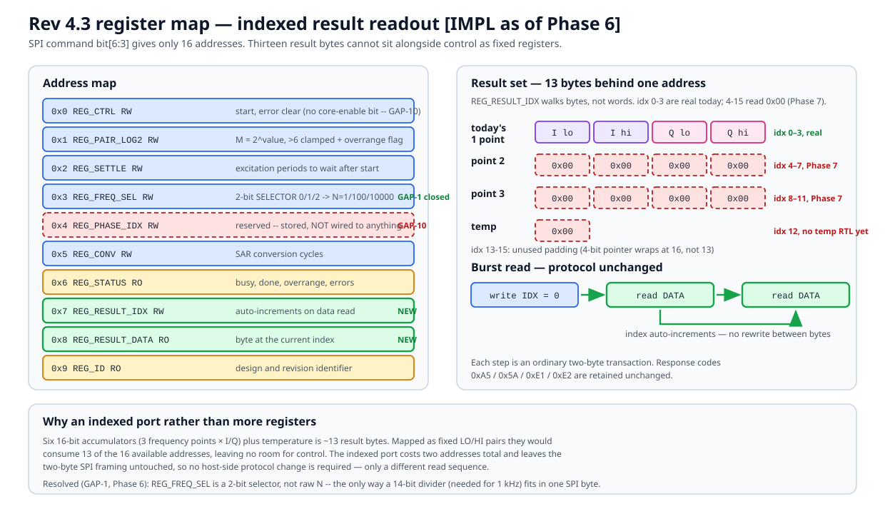

### 7.3 SPI command format **[IMPL]**
- bit7: RW (1=READ, 0=WRITE)
- bit6:3: register address
- bit2:0: reserved, shall be zero

### 7.4 SPI response byte codes **[IMPL]**
- 0xA5 write accepted (ACK)
- 0x5A write rejected (NACK)
- 0xE1 invalid command (reserved bits violation)
- 0xE2 invalid address

### 7.5 Framing rule **[IMPL]**
Every SPI transaction is exactly two bytes. If Byte0 is illegal, Byte1 is
consumed and discarded before the next command decode.

### 7.6 Readback contract and byte-boundary timing **[IMPL]**
- Byte 0 of every transaction is always the command word
- Byte 1 is either the write payload or the read dummy cycle
- The read response is preloaded before the dummy byte begins and is shifted out
  on MISO as the host clocks the dummy byte
- `spi_slave` emits exactly one `rx_valid_o` pulse per completed byte
- `agriasic_digital_spi_top` consumes the command byte in the same clk domain and
  does not accept a second byte for the same transaction until the prior byte has
  completed

This contract is what prevents stale status or result values from being returned
in the next byte window.

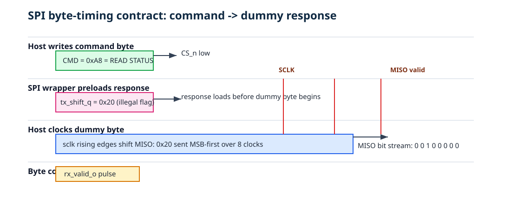

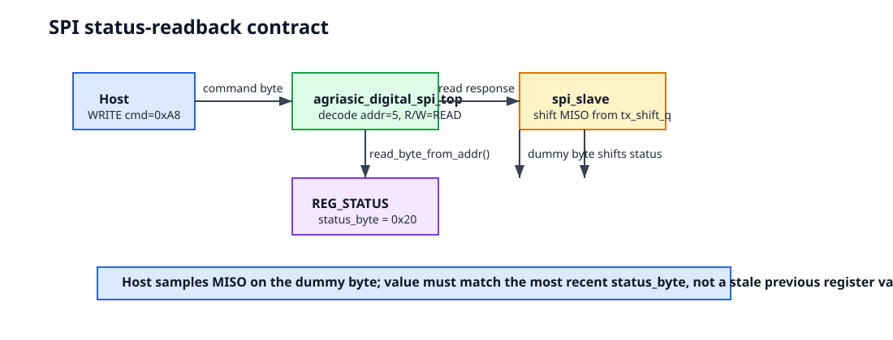

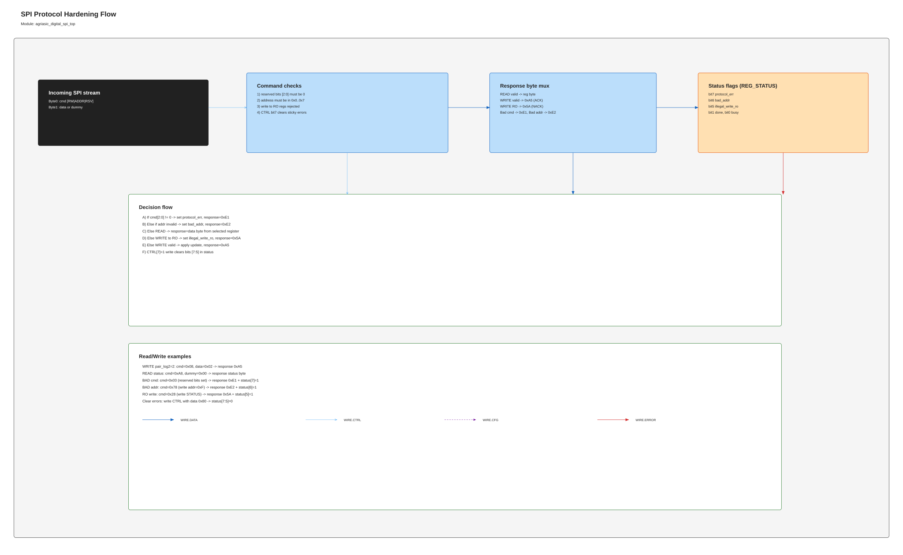

---

## 8. Clocking, Reset and Error Handling

### 8.1 Clocking **[IMPL]** unless noted
- Single clock domain at **160 MHz** (the sim clock period stands in for 160 MHz
  timing; actual 160 MHz closure is a physical-design question, not verified
  by RTL simulation) — verified by grep: every `always_ff` in `rtl/` is on
  `posedge clk` or the documented SPI exception, nothing else
- The core receives a **clock enable, not a gated clock** — verified by grep:
  no `.clk(...)` connection anywhere is a derived/gated expression. Section
  6.12 has the implementation and the 93%-of-cycles-frozen measurement
- No CDC anywhere except SPI — same grep, same result
- Core clock-enabled off during accumulation bursts — this is the boolean
  "off while a measurement is in flight" gating from section 6.12, **not** the
  fallback below, which is a different technique for a different problem

**Timing-closure fallback — [SPEC], not implemented.** If the flow will not
close 160 MHz on the accumulate path specifically, keep only the phase counter
and strobe at full rate and clock-enable the accumulate logic every fourth
cycle (a periodic 1-cycle-in-4 enable, distinct from the boolean burst-gating
above). This is a physical-design contingency, not something RTL simulation
can confirm is needed or sufficient.

**Phase-resolution fallback — [SPEC], not implemented.** If the pad, clock buffer
and sampling logic do not close 160 MHz in this process, drop to **8 phase
steps at 80 MHz**, which still supports I and Q at 45-degree resolution. Phase
steps fall out of the divider counter, so no delay line or DLL is required
either way. This only becomes relevant once Phase 4's phase counter exists.

### 8.2 Reset **[IMPL]**
- `rst_n` asynchronous assert, **synchronous deassert** via a 2FF reset
  synchronizer (`rst_sync`, section 6.12), instantiated once per chip-boundary
  top — verified at multiple clk-unaligned assert/deassert phases by
  `tb_rst_sync.sv`
- State machines return to deterministic idle/reset states **[IMPL]**
- Configuration registers return to defaults **[IMPL]**
- Sticky protocol bits clear on reset **[IMPL]**

### 8.3 Error policy **[IMPL]**
- Illegal command/address/RO write do not alter configuration payload targets
- Sticky status bits remain set until software clear via CTRL bit7

---

## 9. Timing and Control Contracts

### 9.1 Implemented **[IMPL]**
- `conv_start_o` is a one-cycle pulse per accepted sample request
- `done_o` and `busy_o` are mutually constrained by end-of-sequence semantics
- **(Phase 4)** A sample strobe (`sample_req_o`/`sample_phase_o`) is issued
  **only** when the free-running phase counter equals the selected phase index
  (0 for D+, 8 for D-) — there is no longer a `settled_i` handshake to gate on;
  settle is now a one-time period count in `S_SETTLE` before the FSM starts
  watching for phase matches at all (section 6.1). Verified exactly, not just
  asserted: `tb/smoke/tb_agriasic_digital_top.sv`'s phase-match check confirms
  every sample in a full 4-pair run lands on the documented index, using the
  cycle-before-transition phase value (section 6.11's reading note)
- The `sar_done_i` handshake gates transitions out of sample states
- `{exc_drive_p_o, exc_drive_n_o} = 2'b11` structurally unreachable — asserted
  every cycle in `tb_excitation_drive.sv`, holds for the free-running Phase 4
  design as it did for the Phase 1 FSM-commanded design
- **(Phase 4)** `f_exc = f_clk / (16 x N)` holds **exactly**, not
  approximately: `tb_excitation_drive.sv` measures 16, 80, and 208
  cycles/period for N=1, 5, 13 respectively, with zero drift — this replaces
  the pre-Phase-4 divider, whose tick comparison actually produced periods of
  `divider_i + 1` cycles (an off-by-one bug fixed, not carried forward — see
  section 6.3)
- **(Phase 4)** Positive and negative half-cycles are equal to within one
  clock cycle by construction: 7 phase states per half (0-6 and 8-14), each
  lasting the same N cycles — this was unmeasurable before Phase 4 since the
  FSM-commanded flip had no fixed period to check it against, and is now a
  structural property of the phase encoding, not a tuned value
- `adc_comp_i` unsynchronized; the controller guarantees `conv_cycles_i` cycles
  of comparator regeneration time by construction before sampling it, per bit
  trial — no comparator regeneration number is known yet (GAP-2), so this is
  the mechanism, not a validated timing margin
- SAR bit-trial conversion time: `8 × (3 + conv_cycles_i)` clock cycles, verified
  for `conv_cycles_i` ∈ {0, 2}

**Settle timing after Phase 1 and Phase 4:** because break-before-make adds
`DEAD_CYCLES` before drive can assert, and SAR conversion takes 24+ cycles
instead of the few cycles `adc_code_i` needed, total run time grew
substantially versus the pre-Phase-1 baseline (measurement smoke: 480 result
in 368 cycles at N=1/settle=2, section 6.11, vs. the pre-Phase-1 ~73). Phase 4
changed the *unit* `settle` is measured in (excitation periods, not raw
cycles) but the *ratios and monotonicity* `tb_settle_timing` checks are
unaffected — settle=0 < settle=2 < settle=5 < settle=20 still holds at the new
unit. Nothing about either change is a defect; it is the real cost of moving
from a placeholder ADC/excitation signal to actual bit-trial and phase-lock
mechanisms.

### 9.2 Rev 4.3 additions still outstanding **[SPEC]** — Phase 5
- Sign and accumulator selection by phase index (0°/180° → I, 90°/270° → Q) —
  today there is exactly one phase pair (0/8) and one accumulator
- A second phase-index pair (4 and 12, for 90°/270°) to strobe the Q
  accumulator

The phase-lock strobe mechanism this section used to specify (Phase 4) is
implemented — see section 9.1. What remains outstanding is purely the I/Q
split.

### 9.3 Contracts to freeze **[SPEC]**

```text
f_exc = f_clk / (16 * N)          phase step = 22.5 degrees
f_clk = 160 MHz                   for 10 MHz excitation with 16 phase steps
```

**Sampling aperture.** Under **5 ns**, with jitter small enough to hold phase
error below **one degree at 10 MHz**.

**Accumulator width.** 16-bit signed. Worst case at M = 64 is
`64 × 255 = 16320`, inside the 32767 limit. At M = 128 the worst case is 32640 —
inside the limit but **without margin** — so constrain M to 64 or widen to 18
bits. `REG_PAIR_LOG2` is therefore constrained to 6 or less.

**Phase command handshake.** Superseded by Phase 4. There is no longer a
polarity command to hand-shake on — the excitation generator is free-running
and the FSM only watches its phase counter (section 6.1, section 9.1). The
D-1/D-2 edge-triggered command mechanism this contract described no longer
exists in any form and cannot regress (section 6, `tb_settle_timing.sv`
header). The replacement contract, watch-and-strobe on phase match, is
implemented and verified (section 9.1) but not yet asserted as a formal RTL
`assert property` — that remains open (see V-5, section 12.3).

**Accumulator snapshot.** The FSM writes accumulators into shadow registers
**only at completion**, so the core can never read a partial sum. A start written
while busy is **ignored and sets an error bit** rather than restarting mid-burst.

**Boundary to defend.** The FSM never gets a program counter. If it needs
branching beyond "repeat M times", it has become a second processor and the
schedule cannot absorb verifying two of them.

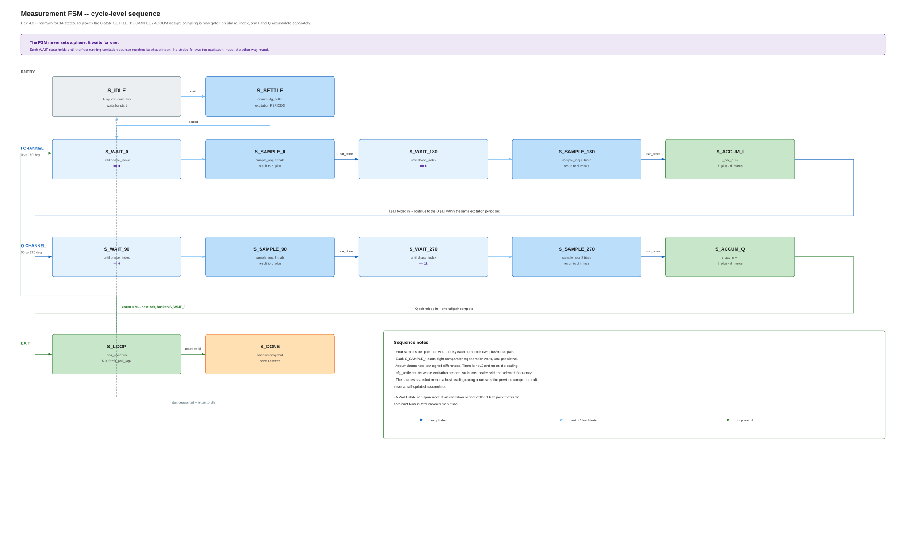

---

## 10. Rev 4.3 Implementation Plan

Sequenced by **external-contract risk first**: pin-level changes block analog
teammates and the 2026-11-18 trial GDS, so they are frozen before internal
restructuring. Every phase lands behind the existing 5-stage regression sweep,
which must stay green.

### Phase 0 — Verified baseline ✅ complete
Three defects fixed, chip lints clean, 5-stage sweep green (lint, measurement
smoke 480, SPI smoke 480, settle regression, e2e average 400).

### Phase 1 — Freeze the analog boundary ✅ complete **(highest external risk)**
| Step | Work | Blocks | Status |
|---|---|---|---|
| 1.1 | Replace `exc_pol_o` with `exc_drive_p_o`/`exc_drive_n_o`; break-before-make; make `2'b11` structurally unreachable; add an assertion proving it | Analog drive, pad ring | **Done.** `DEAD_CYCLES` parameter, default 1 cycle — placeholder pending analog sign-off (GAP-6) |
| 1.2 | Rewrite `sar_controller` as a real bit-trial engine: `adc_enable_o`, `adc_sample_o`, `adc_dac_o[7:0]`, `adc_comp_i`. Delete `adc_code_i` | ADC analog core | **Done.** `conv_cycles_i` (REG_CONV) reinterpreted as regeneration wait per bit trial — placeholder value, runtime-tunable (GAP-2 still open, now de-risked: no respin needed once characterized) |
| 1.3 | Add `miso_oe_o` for MISO high-Z when `cs_n` inactive | Pad ring | **Done.** Registered in the SCLK domain alongside `miso_o`; `assert property (miso_oe_o == !cs_n_i)` holds |

**Exit criterion met at the RTL level:** pin list is implemented, lints clean,
and covered by three new regression tests — `tb_excitation_drive.sv` (break-
before-make, structural `2'b11` exclusion), `tb_sar_bit_trial.sv` (bit-trial
convergence across the full 0–255 range), and the `miso_oe_o` assertion added
to the existing SPI smoke test. **Not yet done:** actual sign-off with the
analog owners on `DEAD_CYCLES` and the comparator regeneration time — the pins
exist and work in simulation, but the two placeholder timing values (GAP-2,
GAP-6) are still guesses, not characterized numbers. Regression sweep is now
7 stages (was 5): + SAR bit-trial, + excitation drive.

**Verified 480/400 unchanged.** Both the measurement result (480) and e2e
average (400) are bit-for-bit the same as pre-Phase-1 — the bit-trial engine is
functionally transparent to measurement correctness, as it must be. What
changed is timing: conversions now take 24+ cycles instead of a handful, so
absolute cycle counts grew substantially (documented in section 9.1) while
every monotonicity/correctness check still passes.

### Phase 2 — Clock and reset discipline ✅ complete
| Step | Work | Status |
|---|---|---|
| 2.1 | 2FF reset synchronizer at top: async assert, sync deassert | **Done.** `rst_sync.sv`, instantiated in all three chip-boundary tops. Verified at 4 clk-unaligned phase offsets by `tb_rst_sync.sv` |
| 2.2 | Core clock enable (`core_clk_en`), off during accumulation bursts. Enable, never a gated clock | **Done.** Threaded into `DatapathPipelined`/`RegFile`; driven automatically by `agriasic_rv32i_control_shell.sv` off the real `start_pulse_o`/`measurement_done_i` handshake. Verified via `tb_agriasic_rv32i_e2e.sv`: 93% of total cycles frozen across 4 real measurements, zero PC-freeze violations, bit-exact results |
| 2.3 | Document and assert the single-160 MHz-domain rule; no CDC except SPI | **Done** as a verified grep check, not just prose: every `always_ff` in `rtl/` is on `clk` or the documented SPI exception; every `.clk(...)` connection is the bare signal, never gated |

**What "verified" means here, precisely:** the freeze mechanism is exercised
through its *real* trigger path (an actual measurement run), not a synthetic
forced scenario — the 93% figure and the zero-violation assertion both come
from the same firmware run already used for end-to-end correctness. The
reset synchronizer, by contrast, needed a *dedicated* test: every other
testbench in this tree drives `rst_n` cleanly and synchronously, so none of
them exercised the async, clk-unaligned edge that `rst_sync` exists for.
Regression sweep is now 8 stages (was 7): + reset sync.

**Not yet closed:** whether 160 MHz genuinely meets timing on the accumulate
path is a physical-design question RTL simulation cannot answer. The two
fallbacks in section 8.1 (periodic 1-cycle-in-4 enable; 8 phase steps at
80 MHz) exist for exactly that contingency and remain **[SPEC]**.

### Phase 3 — SPI domain rework ✅ complete
| Step | Work | Status |
|---|---|---|
| 3.1 | 2FF synchronizers for `sclk`/`cs_n`/`mosi` in the clk domain; remove every `always_ff @(posedge sclk_i)` | **Done.** Verified by grep: zero matches outside `posedge clk` in the synthesizable tree |
| 3.2 | CPOL=0/CPHA=0 MISO on synchronized falling-edge detect; enforce max SCLK = f_clk/16 | **Done.** `tb_spi_domain_crossing.sv` verifies correct transfer at exactly `f_clk/16` and demonstrates corruption at a rate below the sampling clock's own Nyquist rate |
| 3.3 | `cs_n` rising resets framing only, never measurement state | **Done.** Verified: mid-byte deselect + reselect starts a clean new byte, no module reset needed |
| 3.4 | Refresh `interface_contract.md`, which is already stale by three SPI changes | **Done.** Full rewrite reflecting the current register map, response codes, `miso_oe_o`, and the `f_clk/16` timing contract |

**Resolved, not left open:** the plan's own note anticipated that removing the
toggle-synchronizer CDC might let the inter-byte-gap host requirement (section
6.7) be relaxed. Checked directly: `agriasic_digital_spi_top`'s response byte
(`spi_tx_data`) is a single registered update inside
`if (spi_rx_valid) begin ... end`, and `read_byte_from_addr` is pure
combinational — so the response is ready **exactly 1 clk cycle** after byte
completion. At `f_clk/16`, even a fully back-to-back byte (zero explicit gap)
gives ≥8 clk cycles before the next possible falling edge. **The inter-byte
gap requirement is now satisfied automatically by the `f_clk/16` rate limit
itself and does not need to be called out as a separate host-facing
requirement.** The RTL's defensive TX pattern (bit 7 driven combinationally,
remaining 7 bits shifted) is kept regardless — it costs nothing and remains
correct, it's just no longer the only thing standing between a fast host and a
stale byte.

### Phase 4 — Phase-locked excitation ✅ complete *(the architectural inversion)*
| Step | Work | Status |
|---|---|---|
| 4.1 | `excitation_ctrl` becomes a free-running divider + 4-bit phase counter; export `phase_index_o[3:0]` | **Done.** Rewritten; `period_tick_o` also added. Phase encoding: 0-6 drive positive, 7 dead, 8-14 drive negative, 15 dead — 7 states/half, exact symmetry (section 6.3) |
| 4.2 | **Widen the divider to ≥14 bits** — see [GAP-1] | **Done.** `divider_i`/`cfg_divider_q` widened to 14 bits end-to-end through `agriasic_digital_top`, both control shells, and MMIO (fully 14-bit, no windowing). SPI and the byte-oriented programming interface keep an 8-bit write/read window onto the 14-bit register for now — extending that window is Phase 6's job, not Phase 4's (GAP-1, encoding half still open) |
| 4.3 | `measurement_fsm` strobes on phase-index match; remove the per-flip polarity command | **Done.** States are now `S_IDLE, S_SETTLE, S_WAIT_P, S_SAMPLE_P, S_WAIT_N, S_SAMPLE_N, S_ACCUM, S_LOOP, S_DONE`; `exc_set_phase_o`/`exc_phase_o`/`settled_i` removed entirely, not deprecated in place (section 6.1) |
| 4.4 | Equivalent-time sampling: one phase point per excitation cycle across many cycles | **Done.** Verified structurally (excitation never waits on the FSM) and behaviorally: `tb/smoke/tb_agriasic_digital_top.sv`'s phase-match check confirms every sample across a full 4-pair run lands on the exact documented phase index, not merely the right half-cycle (section 3.2, section 6.11) |

**Exit criterion met:** the 9-stage regression sweep (`verify_all.sh`) is green,
including the rewritten `tb_excitation_drive.sv` (exact N-cycle timing at
N=1/5/13, structural `2'b11` exclusion) and the smoke/SPI/e2e/settle tests
updated for the new interface. **Two real bugs were found and fixed while
building this, not just claimed fixed:**

1. **Off-by-one divider bug (pre-existing since Rev 4.2).** The old tick
   comparison produced a period of `divider_i + 1` cycles, not `divider_i`.
   Harmless when `divider_i` only qualitatively gated a settle check;
   unacceptable once it must be a precise, host-computable N. Fixed in the new
   design — verified exact at three divider values (section 6.3).
2. **Testbench ADC model correctness gap, found only because excitation
   became free-running.** All six testbenches' behavioral comparator models
   read `exc_drive_p_o` *live* every cycle to pick a target code. That was
   correct when excitation only changed on a command the FSM controlled, but
   once excitation is free-running, `exc_drive_p_o` can change mid-conversion
   (a SAR conversion takes 24+ cycles; one phase state can last as little as 1
   cycle at N=1) — so the model could sample a *different* phase's target than
   the one actually captured at `adc_sample_o`. First symptom: the smoke test
   failed outright, `expected=480 got=204`. Fixed by making every testbench's
   ADC model track-and-hold: latch the target on `adc_sample_o` and hold it,
   exactly like a real T&H would, instead of re-deriving it live from a drive
   signal that may have already moved on.

**A verification gap was also closed proactively, not left implicit:** a
numerically correct `result=480` does not by itself prove samples landed on
the *documented* phase index (0 and 8) rather than merely "somewhere in the
7-state positive/negative half" — the track-and-hold ADC model can't tell
those apart, since `exc_drive_p_o` reads true across all of phase 0-6. The
phase-match check added to `tb/smoke/tb_agriasic_digital_top.sv` (section
3.2, section 6.11) closes this by comparing the actual `phase_index_i` value
at the moment each sample was requested against the exact expected index.

**Warning realized, as flagged in the prior revision of this plan:** this
changed measurement semantics, so every timing expectation in the testbenches
moved again (368 cycles for the smoke test at N=1/settle=2, vs. the
pre-Phase-4 ~300+), exactly as the D-3 fix moved 240 → 480 and Phase 1 moved
~73 → ~300+. The *numeric* result (480) did not move, because the underlying
math (`M x (D+ - D-)`) is unchanged — only cycle counts and the sampling
mechanism did.

### Phase 5 — I/Q accumulation
| Step | Work |
|---|---|
| 5.1 | Two signed 16-bit accumulators (I and Q) |
| 5.2 | Sign and accumulator selection by phase index: 0°/180° → I, 90°/270° → Q |
| 5.3 | Shadow registers snapshot on `done` so the core never reads a partial sum |
| 5.4 | M ≤ 64 — already enforced |

### Phase 6 — Register map and readout
| Step | Work |
|---|---|
| 6.1 | `REG_RESULT_IDX` (auto-incrementing) + `REG_RESULT_DATA` |
| 6.2 | Six 16-bit accumulators (3 frequencies × I/Q) plus temperature |
| 6.3 | Frequency-selection register and widened divider write path |

### Phase 7 — Sweep policy in firmware
| Step | Work |
|---|---|
| 7.1 | Three frequency points → divider N values (see [GAP-1] table) |
| 7.2 | Four phase offsets per point |
| 7.3 | Temperature read and result packing |
| 7.4 | Mirror any shell interface change into the microsequencer per section 4.2 |

### Phase 8 — Verification and signoff
| Step | Work |
|---|---|
| 8.1 | V-1 through V-5 from section 12.3, added to `verify_all.sh` as each lands |
| 8.2 | Assertions: `{p,n}` never `2'b11`; half-cycle symmetry; accumulator range |
| 8.3 | Refresh this MAS and `interface_contract.md`; re-run the 77-test ISA regression |

### 10.1 Effort and ownership

From the Rev 4.3 baseline section 5. Rev 4.3 adds roughly **1.5–2 FTE-weeks** over
Rev 4.2, most of it the excitation restructure and the defect fixes. The FSM
promotion itself is nearly free because the block already exists; what is new is
the handshake discipline and the cross product of core and FSM states in
verification.

| Block | Owner | Delta | Status | MAS phase |
|---|---|---|---|---|
| Excitation generator | Krishna, Taarana | 0.8 wk | Rework | 4 |
| Measurement FSM | Taarana | 0.6 wk | Rework | 1.2, 4 |
| I/Q accumulators | Taarana | 0.5 wk | **New** | 5 |
| Core and program | Taarana | 0.4 wk | Exists | 7 |
| SPI and regfile | Taarana | 0.3 wk | Rework | 3, 6 |
| Wideband TIA | Krishna | 1–2 wk | Unchanged | — |
| SAR ADC | Vidhu | 1.0 wk | Unchanged | — |
| Temp sense (PTAT) | Vidhu | 0.5 wk | Unchanged | — |

Digital total ≈ **2.6 wk**, against a 2026-11-18 trial GDS. The excitation
generator is jointly owned, which makes Phase 4 the coordination risk as well as
the technical one.

### 10.2 Descope path

The descope path **improves** under Rev 4.3. Because the FSM owns all measurement
behaviour, dropping the core at the Week 4 gate changes nothing about what the
chip measures — it only removes the ability to change the sweep program after
tapeout. Present it as the planned contingency, not a failure mode. Section 4.2's
port-identical shells make the cut a file swap.

Descope order, applied only as far as needed:

1. Drop the 32 MHz stretch point
2. Reduce phase steps from 16 to 8, halving the required clock to 80 MHz
3. Replace the core with a fixed FSM program
4. Reduce the sweep from three frequency points to two, keeping the widest separation

**Retain in all cases:** two frequency points, I and Q accumulation, the TIA,
8-bit conversion, temperature sense, reset safety, and a readable result vector
over SPI.

### 10.3 Open gaps

**[GAP-1] Divider width — RESOLVED (counter); register encoding still open
for Phase 6.** With `f_exc = f_clk/(16·N)` at `f_clk = 160 MHz`:

| Target f_exc | Required N | Bits needed |
|---|---|---|
| 10 MHz | 1 | 1 |
| 100 kHz | 100 | 7 |
| **1 kHz** | **10000** | **14** |

Pre-Phase-4, `divider_i` was 8 bits, so N maxed at 255 and the excitation floor
was **39.2 kHz** — the 1 kHz point, the one carrying most of the ionic
information since the `1/w` term is strongest at low frequency, was
unreachable. **As of Phase 4, the divider counter and its compare are 14
bits** throughout `excitation_ctrl`, `agriasic_digital_top`, both control
shells, and the MMIO path — the 1 kHz point is reachable today from a program
running on the RV32I core.

What Phase 4 did **not** resolve, deliberately scoped out to Phase 6: the
byte-oriented interfaces (SPI, the parallel programming interface) still
expose only an 8-bit write/read window onto the 14-bit register, zero-extended
on write and truncated on read (section 7.1). This means N is reachable up to
16383 via MMIO today, but only up to 255 via SPI until Phase 6 decides the
register encoding:

| Reading | Register holds | Register width over SPI | Divider counter width |
|---|---|---|---|
| **Selector** | An index (0/1/2) into three preset N values | 8 bits is fine | already **14 bits** |
| **Raw N** | N itself | needs **≥14 bits**, so two SPI bytes | already **14 bits** |

The counter is no longer the open question — only the SPI-visible register
encoding is. The selector reading is cheaper — it keeps `REG_FREQ_SEL` a
single byte and keeps the two-byte SPI protocol untouched — and matches
"three selectable frequencies" (section 5). **Recommend the selector encoding**
unless arbitrary frequencies are needed for bring-up characterization.

Settle timing is unaffected either way: `settle_cycles_i` now counts
excitation *periods* (section 6.1), so even a modest settle value is ample
margin at any reachable N.

**[GAP-7] Sample points sit immediately adjacent to a dead-time/transition
state, with no settle margin inside the sampled half-cycle itself.** Found
during Phase 4 design, not resolved, and not silently assumed away. Phase
encoding is 0-6 positive drive, 7 dead, 8-14 negative drive, 15 dead (section
6.3); the FSM samples at phase index 0 (first cycle of the positive half) and
8 (first cycle of the negative half) — i.e., the *very first* clock cycle
after each polarity transition, with zero phase states of settle time inside
that half-cycle before the sample is requested. `S_SETTLE` (section 6.1)
provides settle time *before the FSM starts watching for a phase match at
all*, measured in whole excitation periods — but once the FSM is watching,
the phase it locks onto is always the first cycle of the half, not a cycle
comfortably after the transition. Whether this matters depends on the analog
settling time constant relative to one clock period (6.25 ns at 160 MHz),
which is not yet characterized (see GAP-6, dead time, and GAP-2, comparator
regeneration — both analog-timing unknowns this gap is adjacent to but
distinct from). **This needs analog/systems review before trusting samples at
the fastest excitation points**, where one clock period is a larger fraction
of the excitation half-period. A fix, if needed, is cheap in RTL — sample at
a phase index a few states into the half (e.g., 2 or 10 instead of 0 or 8)
— but changing it moves the D+/D- targets in every testbench again, so it
should be decided once, deliberately, not discovered late.

**[GAP-2] Comparator regeneration time is unknown.** No longer blocks Phase 1 —
`conv_cycles_i` (REG_CONV) is a runtime register, reinterpreted to mean
regeneration wait per bit trial, so the real number can be written into the
chip during bring-up with no respin. It is still **unknown**, and the current
default (used throughout simulation: 1–2 cycles) is a placeholder with no
basis in real comparator behavior. Get a real number from Vidhu before trusting
any bring-up timing budget built on it.

**[GAP-6] Break-before-make dead time is unspecified.** `excitation_ctrl`'s
`DEAD_CYCLES` parameter (default 1 cycle at 160 MHz, 6.25 ns) is a placeholder
with no basis in the actual pad/driver turn-off time. Unlike GAP-2, this is an
RTL **parameter**, not a runtime register — no register map slot exists for it
in the Rev 4.3 spec, and none is proposed, since it's a fixed safety margin
rather than a corner-tunable quantity. **This one does need a respin if wrong**,
since it can't be corrected in the field. Get the real minimum dead time from
Krishna before this is anywhere near tapeout-ready.

**[GAP-3] `interface_contract.md` — RESOLVED for Phase 3, reopened for Phase
4.** The original staleness (predating three SPI changes: sticky `STATUS[1]`,
dummy-byte consumption, mode-0 MISO timing) was fixed by the Phase 3.4 rewrite
(section 10, Phase 3). Phase 4 reopens it in a smaller way: the divider
register is now 14 bits internally with an 8-bit SPI window (section 7.1),
and `settle_cycles_i` now means excitation periods, not raw cycles (section
6.1) — `interface_contract.md` needs both of these noted before host firmware
is written against the divider or settle registers.

**[GAP-4] Shell status outputs are unconnected** in
`agriasic_digital_rv32i_top.sv` (`shell_busy`, `shell_done`, `shell_result`,
`shell_clear_errors`). Open question which is authoritative for an external host.

**[GAP-5] No foundry SRAM macro.** `agriasic_imem`/`agriasic_dmem` are behavioral
models carrying the correct timing contract, with an `AGRIASIC_USE_SRAM_MACRO`
ifdef for memory-compiler output.

---

## 11. Requirement Trace Matrix

| Req ID | Requirement | Implementation Mechanism | Verification | Status |
|---|---|---|---|---|
| DR-001 | Start shall trigger autonomous measurement sequence | REG_CTRL bit0 → start pulse → FSM entry | Smoke TB start-to-done | **[IMPL]** |
| DR-002 | Excitation frequency and settle timing shall be programmable | `cfg_exc_divider_i` sets the free-running divider N; `cfg_settle_cycles_i` sets the `S_SETTLE` period count (Phase 4: polarity is a structural consequence of the phase encoding, not a separately commanded/timed quantity) | `tb_settle_timing` monotonicity, `tb_excitation_drive` exact N-cycle timing | **[IMPL]** |
| DR-003 | SAR comparator regeneration time shall be programmable per bit trial | REG_CONV (`conv_cycles_i`) gates each of 8 bit trials | `tb_sar_bit_trial` timing (24 cyc @ conv=0, 40 @ conv=2) | **[IMPL]** |
| DR-004 | Sequencer shall process positive and negative samples per pair | `S_WAIT_P`/`S_SAMPLE_P` and `S_WAIT_N`/`S_SAMPLE_N` watch the free-running phase counter for a match at index 0 and 8 respectively (Phase 4: replaces the old commanded-flip mechanism) | D+/D− update checks, plus exact phase-index match verification | **[IMPL]** |
| DR-005 | Result shall accumulate the **raw** signed pair difference | S_ACCUM adds `pair_delta` with sign extension, no scaling | Deterministic result check (480) | **[IMPL]** |
| DR-006 | SPI framing shall be a deterministic 2-byte protocol | Byte0 decode + Byte1 always consumed | SPI protocol tests | **[IMPL]** |
| DR-007 | Illegal SPI commands shall be detectable | reserved-bit and bad-address checks → sticky bits | Negative-path SPI tests | **[IMPL]** |
| DR-008 | Illegal writes to RO registers shall be rejected | legality checks + NACK | write-to-RO test | **[IMPL]** |
| DR-009 | Status shall expose busy/done and protocol errors | REG_STATUS [7:5],[1:0] | status mirror checks | **[IMPL]** |
| DR-010 | Sticky errors shall be software-clearable | REG_CTRL bit7 write-one-clear | clear-after-error sequence | **[IMPL]** |
| DR-011 | SPI byte crossing shall avoid duplicate byte-valid pulses | Rev 4.3 Phase 3: byte detection is native to the clk domain (2FF-oversampled edge detect), so there is no crossing left to produce a duplicate on. The pre-Phase-3 toggle synchronizer this row originally described is removed | `tb_spi_domain_crossing` confirms exactly one `rx_valid_o` pulse per byte | **[IMPL]** |
| DR-012 | Fallback path shall remain viable without the CPU | port-identical microsequencer shell | 14-port identity verified | **[IMPL]** |
| DR-013 | Settle interval shall have a monotonic, observable effect | `S_SETTLE` counts `period_tick_i` pulses against `settle_cycles_i` (Phase 4: unit is now excitation periods, not raw cycles) | `tb_settle_timing` | **[IMPL]** |
| DR-014 | Excitation frequency shall be directly selectable | Free-running divider + 16-state phase counter, `f_exc = f_clk/(16·N)` exact | `tb_excitation_drive`: exact 16/80/208-cycle periods at N=1/5/13, zero drift | **[IMPL]** Phase 4 |
| DR-015 | Drive outputs shall never both assert | break-before-make, `2'b11` structurally unreachable | `tb_excitation_drive` assertion, every cycle | **[IMPL]** Phase 1.1 |
| DR-016 | SAR bit trials shall be performed in digital | `adc_dac_o`/`adc_comp_i` 8-trial search | `tb_sar_bit_trial`, full 0–255 sweep | **[IMPL]** Phase 1.2 |
| DR-017 | I and Q shall be accumulated separately | two signed 16-bit accumulators | — | **[SPEC]** Phase 5 |
| DR-018 | Core shall never read a partial sum | shadow registers on done | — | **[SPEC]** Phase 5.3 |
| DR-019 | Result block shall be readable within 16 SPI addresses | indexed auto-incrementing readout | — | **[SPEC]** Phase 6.1 |
| DR-020 | SPI shall be the only asynchronous domain, oversampled rather than run as a second clock | `sclk_i`/`cs_n_i`/`mosi_i` 2FF-synchronized in `spi_slave`; zero `always_ff` outside `clk` anywhere in the tree | grep audit + `tb_spi_domain_crossing` | **[IMPL]** Phase 3.1 |
| DR-025 | Max SCLK shall be enforced at `f_clk/16` | Oversampling ratio itself is the enforcement mechanism, not a runtime rate check | `tb_spi_domain_crossing`: correct at exactly `f_clk/16`, corrupted below the sampling Nyquist rate | **[IMPL]** Phase 3.2 |
| DR-021 | MISO shall be high-Z when not selected | `miso_oe_o`, registered with `cs_n_i` in the SCLK domain | `assert property (miso_oe_o == !cs_n_i)` in SPI smoke | **[IMPL]** Phase 1.3 |
| DR-022 | External reset shall be asynchronously assertable, synchronously released | `rst_sync`, 2FF, one per chip-boundary top | `tb_rst_sync`, 4 clk-unaligned phase offsets | **[IMPL]** Phase 2.1 |
| DR-023 | Core shall be clock-enabled off during a measurement, never clock-gated | `core_clk_en_i` on every core register; driven by the shell's start/done handshake | `tb_agriasic_rv32i_e2e` PC-hold assertion, 93% frozen, zero violations | **[IMPL]** Phase 2.2 |
| DR-024 | Design shall use exactly one clock domain outside SPI | grep audit: every `always_ff` on `clk` or documented SPI exception | Structural grep, not simulation | **[IMPL]** Phase 2.3 |
| DR-026 | Every sample shall be taken at the exact documented phase index, not merely within the correct half-cycle | `measurement_fsm` strobes only on an exact `phase_index_i` match | `tb/smoke/tb_agriasic_digital_top.sv` phase-match check: compares the actual phase index at request time against the expected index for every sample in a full run | **[IMPL]** Phase 4.3/4.4 |
| DR-027 | The excitation divider shall support the full 1 kHz-10 MHz sweep range | `divider_i`/`cfg_divider_q` widened to 14 bits end-to-end (`excitation_ctrl`, `agriasic_digital_top`, both control shells, MMIO); off-by-one tick bug from the 8-bit design fixed so `divider_i` equals N exactly | `tb_excitation_drive`: exact period at N=1/5/13; MMIO path reaches N up to 16383 | **[IMPL]** Phase 4.2 (MMIO); SPI/programming interfaces still 8-bit windowed, see GAP-1 |

---

## 12. Verification Plan

### 12.1 Test categories
- T1 Reset determinism and startup
- T2 Nominal sequence completion and result correctness
- T3 SPI legal transactions and readback integrity
- T4 SPI illegal command/address/RO-write behavior
- T5 Sticky error clear and command recovery
- T6 CDC sanity on byte-valid pulse semantics
- T7 Settle-interval monotonicity and deadlock freedom **(new, D-1/D-2)**
- T8 Drive-overlap and half-cycle symmetry assertions **[IMPL]** as of Phase 4 (structural, both properties hold for the free-running design)
- T9 Bit-trial sequencing against an ADC behavioral model **[IMPL]** as of Phase 1 (`tb_sar_bit_trial.sv`)
- T10 Exact phase-index match on every sample **(new, Phase 4)** — **[IMPL]**

### 12.2 Current collateral **[IMPL]**
The `verify_all.sh` sweep runs nine stages, all passing:

| Stage | Check | Result |
|---|---|---|
| 1 | Full chip lint | clean |
| 2 | Measurement smoke | pass, result 480, phase-match checked (0 errors) |
| 3 | SPI smoke | pass, result 480 |
| 4 | SAR bit-trial unit test (Phase 1) | pass, exact convergence over 0–255 |
| 5 | Excitation free-running phase generator (Phase 4, rewritten) | pass: exact 16/80/208-cycle periods at N=1/5/13, phase-to-drive map (0-6 P, 7 dead, 8-14 N, 15 dead), `2'b11` unreachable holds |
| 6 | Reset synchronizer (Phase 2.1) | pass, 4 clk-unaligned phase offsets |
| 7 | SPI clk-domain rework (Phase 3) | pass, correct at exactly `f_clk/16`, corrupted below Nyquist, clean mid-byte reframe |
| 8 | Settle timing regression (reinterpreted for Phase 4: settle now counts excitation periods) | pass |
| 9 | End-to-end firmware + measurement (incl. core clock enable, Phase 2.2) | pass, average 400, 93% of cycles frozen |

**Testbench fix made necessary by Phase 4, applied to all six testbenches with
a behavioral ADC model** (`tb/smoke/tb_agriasic_digital_top.sv`,
`tb/smoke/tb_agriasic_digital_spi_top.sv`, `tb/tb_agriasic_rv32i_e2e.sv`,
`tb/tb_diag.sv`, `tb/tb_settle_timing.sv`, `tb/tb_spi_diag.sv`): the comparator
model now latches its target on `adc_sample_o` (track-and-hold) instead of
reading `exc_drive_p_o` live every cycle — see section 10, Phase 4 for why a
live read silently produced a wrong result (`480` expected, `204` measured)
once excitation became free-running.

**Separately, and NOT re-run for Phase 2:** 77/77 on the rv32ui ISA suite +
dhrystone, which needs the external CIS 5710 cocotb harness and a built
`riscv-tests`, neither present in this environment. Phase 2.2 touched
`agriasic_rv32i_core.sv` (`DatapathPipelined`, `RegFile`) — the same file this
suite exercises. The generic `Processor`/`MemorySyncUnified` wrapper that
harness uses ties `clk_en_i` permanently high (section 6.12), so every branch
this change added is provably dead code on that path — but "provably dead
code" is not the same as "re-run and confirmed 77/77." Re-run this suite
before treating Phase 2 as signed off.

Style constraints: SystemVerilog, self-checking testbenches, **Icarus-compatible**
— no vendor PLI (`$fsdbDump*`, `$vcdplus`, `$shm`) anywhere in the tree.

### 12.3 Required verification additions **[SPEC]**

From the Rev 4.3 baseline, section 8.1. These are specified, not yet built:

| # | Check | Rationale |
|---|---|---|
| V-1 | **Sweep `settle` against `conv` across the full 8-bit range** with a completion timeout on every combination | Either D-1 or D-2 would have been caught by this. Two independently programmable registers jointly determined whether the chip hung, and no single-point test exposes that |
| V-2 | Check `result == M × (D+ − D−)` for **odd** differences, **±1** differences, and **saturating** differences | D-3 was a sign- and magnitude-dependent error; only odd and ±1 cases expose rounding-toward-negative-infinity |
| V-3 | Superseded by Phase 4 — there is no longer a phase command to bound (section 9.3) | — |
| V-4 | Assert the accumulator shadow register **never updates while `busy` is high** | Guarantees the core cannot read a partial sum |
| V-5 | **Partially done:** the phase-match check in `tb/smoke/tb_agriasic_digital_top.sv` verifies this behaviorally for every sample in a real run (section 3.2, section 6.11); a formal RTL `assert property` restating it structurally is still not written | Phase-lock correctness, Phase 4 |

`tb/tb_settle_timing.sv` currently covers a four-point subset of V-1 (settle ∈
{0, 2, 5, 20} at conv = 1) plus monotonicity. **V-1 proper — the full 2D sweep —
is the single highest-value test to add**, and is cheap: it is the test that
turns "we fixed the two defects we found" into "no `settle`/`conv` pair hangs".

### 12.4 Remaining gaps
- Broader randomized SPI traffic and error-recovery tests
- Formal or lint CDC signoff evidence for the byte transport bridge
- Reference traces not regenerated for the synchronous-SRAM core, so cycle-level
  trace comparison is unavailable

---

## 13. Acceptance Criteria for Digital Signoff

- A1. DR-001..DR-013 pass simulation-based checks with archived logs
- A2. Protocol negative paths are reproducible and deterministic
- A3. STATUS and RESULT mirrors stay software-coherent during and after a run
- A4. Reset and restart behavior is stable under repeated runs
- A5. The port-identical microsequencer fallback build remains regression-clean
- A6. For Rev 4.3 signoff: remaining **[SPEC]** rows (DR-017, DR-018,
  DR-019 — the I/Q accumulation and indexed-readout pieces, Phases 5-6)
  implemented, and GAP-1 (encoding half), GAP-2, GAP-6 and GAP-7 closed.
  DR-014, DR-015, DR-016, DR-020..DR-027 are already **[IMPL]** as of Phases
  1-4

---

## 14. Artifact Map

Paths are relative to the repository root.

| Artifact | Path |
|---|---|
| RV32I chip top | `agriasic_digital_v2/rtl/agriasic_digital_rv32i_top.sv` |
| SPI top | `agriasic_digital_v2/rtl/agriasic_digital_spi_top.sv` |
| Measurement top | `agriasic_digital_v2/rtl/agriasic_digital_top.sv` |
| Control shells | `agriasic_digital_v2/rtl/agriasic_rv32i_control_shell.sv{,.orig}` |
| Reset synchronizer (Phase 2.1) | `agriasic_digital_v2/rtl/rst_sync.sv` |
| Control modules | `agriasic_digital_v2/rtl/ctrl/` |
| Processor and SRAM wrappers | `agriasic_digital_v2/rtl/rv32i/` |
| Firmware | `agriasic_digital_v2/fw/` |
| Smoke testbenches | `agriasic_digital_v2/tb/smoke/` |
| Settle regression | `agriasic_digital_v2/tb/tb_settle_timing.sv` |
| SAR bit-trial regression (Phase 1) | `agriasic_digital_v2/tb/tb_sar_bit_trial.sv` |
| Excitation free-running phase generator regression (Phase 1 break-before-make, rewritten Phase 4 for the free-running interface) | `agriasic_digital_v2/tb/tb_excitation_drive.sv` |
| Reset synchronizer regression (Phase 2.1) | `agriasic_digital_v2/tb/tb_rst_sync.sv` |
| SPI clk-domain regression (Phase 3) | `agriasic_digital_v2/tb/tb_spi_domain_crossing.sv` |
| End-to-end testbench (incl. core clock-enable monitor, Phase 2.2) | `agriasic_digital_v2/tb/tb_agriasic_rv32i_e2e.sv` |
| Regression scripts | `agriasic_digital_v2/tb/rv32i_regression/` |
| Rev 4.3 design note | `agriasic_digital_v2/docs/agriasic_rev43_phase_locked_design.md` |
| Implementation plan | `agriasic_digital_v2/docs/agriasic_digital_implementation_plan.md` |
| Timing checklist | `agriasic_digital_v2/docs/agriasic_digital_timing_checklist.md` |
| Diagrams | `agriasic_digital_v2/docs/diagrams/` |
| Slides | `agriasic_digital_v2/docs/slides_svg/` |

---

This MAS is a living document. The **[IMPL]** / **[SPEC]** / **[GAP]** tags are
load-bearing: they are what keeps the target architecture from being mistaken for
the shipped one. Update them in the same commit as the RTL they describe.
